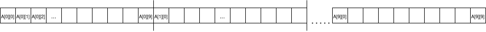
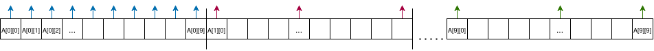
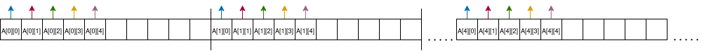

# Examen 2019 VAR 1 Seria 23 - 25

## Exercitiul 1

`Ce este un proces zombie?`

- Raspuns: Un proces din the last of us

`Scrieti o secventa scurta de cod si aratati cand un proces devine zombie`

Verifica aici:
https://sirbuig.github.io/operating-systems/week-4/zombie_orphans

## Exercitiul 2

```c
for(i = 0; i < n; i++){
    fork();
    pthread_create();
    fork();
}
```

`Cate procese si fire de executie sunt create?`

- Raspuns:
  - Avem un loop care merge de n ori => n*2 fork() = 2^(n*2) procese create.
  - Pentru i = 0 avem 2 threaduri
  - Pentru i = 1 avem 2 threaduri + 8 threaduri
  - Pentru i = 2 avem 2 + 8 + 32 threaduri
  - Algoritmul general (just for fun): 2(4^n - 1)/3 threaduri

## Exercitiul 3

```c
do{
    wait(chopstick[i]);
    wait(chopstick[(i+1)%n]);
    // ...
    signal(chopstick[i]);
    signal(chopstick[(i+1)%n]);

}while(true);
```

Aceasta problema permite aparitia fenomenului de deadlock.

`Modificati solutia ridicand asimetric betisoarele: filosofii impari ridica intai betisorul din stanga, cei pari pe cel din dreapta. Aratati ca nu mai apare fenomenul.`

```c
do{
    if (i%2 == 1) {
        wait(chopstick[i]);
        wait(chopstick[(i+1)%n]);

    } else {
        wait(chopstick[(i+1)%n]);
        wait(chopstick[i]);
    }

    // ...

    signal(chopstick[i]);
    signal(chopstick[(i+1)%n]);
}while(true);
```

Problema cu prima varianta era ca daca toti filozofii ridica betisorul din stanga in acelasi timp, o sa intre in deadlock. Asadar, daca cei impari ridica stanga si cei pari dreapta, atunci o sa ramana macar un bestisor liber pentru cineva ca sa manance, candva.

`Aratati daca noua solutie satisface cele trei proprietati: exclusivitate mutuala, progres si timp finit de asteptare.`

- Raspuns:
  - Exclusivitate mutuala este indeplinita intrucat codul implementeaza un semafor (avem wait si signal in format corect)
  - Pentru ca prevenim deadlock, atunci progresul se satisface prin ce am spus mai devreme la primul subpunct.
  - La timp finit de asteptare nu este specificat un mecanism care sa limiteze timpul de stat la coada pentru a manca.

## Exercitiul 4

`Fie o matrice A apartine N 10x10 tinuta contiguu in memorie pe linii si un sistem in care avem 3 frame-uri disponibile. In acest sistem intr-o pagina incap 10 intregi, iar programele P1 si P2 de mai jos incap in totalitate intr-o pagina.`

```c
// P1
for(i = 0; i < 10; i++) {
    for(j = 0; j < 10; j++) {
        A[i][j] = 0;
    }
}

// P2
for(j = 0; j < 5; j++) {
    for(i = 0; i < 5; i++) {
        A[i][j] = 0;
    }
}
```

- Observatii: Primul program completeaza pe linii, iar al doilea pe coloane

`Cum arata programul si datele repartizate pe pagini?`

- Raspuns:
  - A este alocat static, deci va fi acelasi model pentru ambele programe.
  - Fiecare linie poate fi pusa intr-o singura pagina (10 intregi per pagina), deci o sa avem nevoie de 10 pagini + o pagina pentru program = `11 pagini`

Exemplu vizual cum arata liniile asezate:



`Folosind algoritmul LRU, care este programul eficient? De ce?`

- Materie: Daca vorbim de LRU suntem acum pe memoria fizica (frame), paginile erau pentru zona virtuala.

- Raspuns:

  - Programul eficient este P1, deoarece nu o sa aiba atatea page faulturi ca P2.

  - **Hint:** fiecare culoare reprezinta o iteratie (la P1 avem aceeasi culoare pe linii, deoarece se completeaza secvential. La P2 urmariti aceeasi culoare sa vedeti "sariturile" intre pagini)
  - Explicatie P1: Pe primul frame punem programul, dupa executam A[0][0] = 0. Avem page fault, cautam prima pagina cu prima linie si o punem in frame din disk. Dupa pentru urmatoarele 9 elemente nu o sa avem probleme. Continuand tot asa o sa avem in `total 10 page faulturi (pentru fiecare linie)`.

  - 

  - Explicatie P2: Pe primul frame pune programul, dupa executam A[0][0] = 0, page fault, dupa A[1][0] = 0, din nou page fault pentru ca "sarim" pe alta pagina, dupa A[2][0] = 0 si dam page fault etc. Problema este ca mergem pe coloane, iar noi avem matricile puse in memorie pe linii (imaginati-va un vector super lung in dreapta). Iar mergand pe coloane, o sa fie 'haotic'. Deci o sa avem in total `25 page faulturi`.

  - 

`Cum arata diagramele Gannt pentru P1 si P2?`

Desenati explicit pe o banda temporala ce pagini se acceseaza.

e.g. pentru P1 de la timpul 0 la timpul 9 se acceseaza pagina 1...
