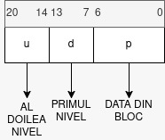

# Examen 29.01.2024 Seria 23 - 25


Am sarit peste ex1 ca mna.

### Exercitiul 2

```c
if(!fork())
    {
        if(fork())
        {
            if(fork())
            {
                if(fork())
                {
                    if(fork())
                    {
                        if(!fork())
                        {
                            if(!fork())
                            {
                                fork();
                            }
                        }
                    }
                }
            }
        }
        else
        {
            if(!fork())
                fork();
        }
    }
```

### Exercitiul 3

Fie un procesor pe 6-biti cu paginare ce emite adrese logice de tip:

5 4  3 2 1 0     
|---|------|  
| p | d    |   
|----------|

`Care este nr total de pagini?`

- Raspuns: Avem 2 biti pentru a codifica nr de pagini (acel "p"), deci 2^2 pagini

`Care este dimensiunea unei pagini?`

- Raspuns: ne uitam la codificare (d) si are 4 biti deci 2^4 bytes este dimensiunea unei pagini = 16 bytes

`Care este dimensiunea totala a memoriei virtuale?`

- Raspuns: 2^2 * 2^4 = 2^6 bytes

`Fie ca pe acest sistem un int sa aiba 2 bytes si fie vectorul de intregi v[10]. De cate frame-uri este nevoie sa tinem tot vectorul in memoria fizica?`

- Raspuns:
    - Avem un vector de 10 intregi fiecare a cate 2 bytes => 20 bytes dimensiunea vectorului.
    - Dimensiunea unui frame == dimensiunea unei pagini = 2^4 bytes = 16 bytes
    - Deci o sa avem nevoie de `2 frame-uri` (primul este plin, al doilea o sa aiba 4 bytes ocupati)

`Apare fragmentare si de ce tip daca da?`

- Teorie: Exista fragmentare interna si externa. Interna se afla daca avem un frame care nu este completat in totalitate. Externa daca avem Frame 1 ocupat, Frame 2 liber, Frame 3 ocupat.

- Raspuns: Avem `fragmentare interna` in acest caz pe frame-ul 2 unde sunt ocupati doar 4 bytes din 16 bytes. (Si raman 10 bytes nefolosibili)

`Unde se afla v[5] si cum arata adresa logica pentru acces?`

- Raspuns: v[5] este al 6-lea element daca contorizam de la 0 si se afla pe primul frame. Deci p = 00, si d = 10 in binar = 1010 => codificare = `001010`

`Cate copii ale lui v ati putea tine maxim in memorie?`

- Raspuns:
    - In total avem 64 de bytes disponibili impartiti in 4 pagini. Un vector are 20 de bytes. Prima intuitie ar fi sa zicem ca putem pune 3 copii, dar ar fi gresit.

    - O pagina are 16 bytes, deci pentru un vector, mai devreme am zis ca avem nevoie de 32 bytes.

    - Deci o sa putem pune doar o copie + cea originala (cu o fragmentare interna pe pagina 2 si 4 de 10 bytes)

`Cum ati modifica paginarea pentru a stoca mai multe?`

- Raspuns:
    - Intr-un context ideal, am dori ca dimensiunea vectorului%dim pagini = 0 ca sa avem fragmentare interna 0.
    - Hai sa facem dimensiunea unei pagini = 4 (2^2) si o sa avem 16 (2^4) pagini
    - Asadar, pentru un vector o sa avem nevoie de 5 pagini si 0 fragmentare interna.
    - Avem 16 pagini in total, 5 pagini per vector => 2 copii in total + cea originala

### Exercitiul 4

`Fie urmatoarea secventa de procese in lista de asteptare, unde CPU este timpul total de executie necesar procesului si Start momentul la care procesul a sosit in coada de asteptare.`

| Proces | Start | CPU |
|--------|-------|---- |
|P0 | 1 | 4|
|P1 | 0 | 3|
|P2 | 3 | 5|
|P3 | 2 | 8|
|P4 | 3 | 1|
|P5 | 2 | 7|
|P6 | 4 | 5|


a) Cum arata diagrama Gantt rezultata in urma aplicarii unui algoritm de tip Round Robin cu cuanta initiala q0 = 3 in care quanta se dubleaza per proces daca procesul este evacuat in urma epuizarii timpului alocat?

Hint: Fiecare proces primeste initial q=3. Daca procesul nu termina executia in unitatile de timp acordate, urmatoarea executie se desfasoara pe o cuanta dubla, conform RR.


b) Dar in urma aplicarii SJF? Algoritmul este preemptive.

Teorie SJF Preemptive: Procesul cu cel mai mic timp de executie ramas are prioritate. Daca soseste un proces nou cu timp de executie mai mic, ii ia locul.

In poza este indexul decalat cu 1 (de ex, P0 este P1 in poza), din cauza site-ului.


c) Care este timpul mediu de asteptare la punctele anterioare?

Pentru RR: 15.57
Pentru SJF: 8.0

### Exercitiul 5

Fie un sistem de fisiere cu strategie de alocare bazate pe indexare pe doua nivele unde un bloc are 128 bytes implementat pe un CPU pe 16-biti unde un byte are 8 biti.

`Cati indecsi pot fi inmagazinati in primul nivel?`

- Teorie: Multilevel Index represinta conceptul de a avea un block de 128 bytes cu pointeri catre alte blocuri (folder cu foldere), iar dupa acele blocuri fiecare are pointeri catre fisiere.(pagina 576 Chapter 14 carte) `Pe romana : Un folder cu foldere, fiecare avand fisiere. `

- Raspuns:
    - CPU pe 16-biti -> un pointer este pe 2 bytes
    - 128 bytes bloc => 64 de pointeri/indecsi

`Dar in total?`

- Raspuns:
    - 64 pointeri => 64 de blocuri cu pointeri
    - 64 * 64 + 64 (fiecare bloc are 64 de pointeri pe al doilea nivel + 64 pointeri de pe primul nivel) = `4160`

`Care este dimensiunea maxima a unui fisier?`

- Teorie:
    - Putem avea un directory care pointeaza catre primul nivel (catre blocul cu pointeri)

- Raspuns:
    - Putem presupune prin absurd ca avem un fisier cat toata dimensiunea memoriei hard.
    - avem 64 de blocuri, fiecare cu 64 de pointeri catre blocuri de 128 bytes
    - 64 * 64 * 128 = 2^6 * 2^6 * 2^7 = 2^19 = 524,288 bytes

`Cum este tradusa o adresa logica in adresa blocurilor la nivelul sistemului de fisiere?`

- Raspuns:
    - Este asemanator cu paginarea de la RAM, doar ca acum avem inca un layer de pagini. (notat in desen cu w (cred))
    - w = primul nivel (cu pointer)
    - d = al doilea nivel (cu pointer)
    - p = datele efective din fisier



`Dar daca am mai adauga un nivel?`

- Raspuns:
    - In stanga lui w mai adaugam inca o casuta de 7 biti pentru inca un nivel, bruh...

