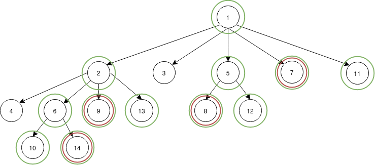

import Question from "@site/src/components/Question";
import Answer from "@site/src/components/Answer";
import ParagraphList from "@site/src/components/ParagraphList";

# Examen 2024 Retake Seria 23 - 25

## Exercitiul 1

<Question>
Fie următoarea secvență de pseudo-cod.

```c
fork()
if (fork()) {
    fork()
    if (!fork())
        pthread_create()
    else
        fork()
    pthread_create()
}
```

Câte procese și thread-uri sunt la final? Desenați arborescența de procese și thread-urile aferente.

</Question>

<Answer>
Sunt 14 procese si 16 thread-uri.

Fiecare cerc este un thread format (prima data cele rosii, la linia 5, apoi cele verzi la linia 8).



</Answer>

## Exercitiul 2

<Question>
Fie un procesor pe 8-biti cu paginare ce emite adrese logice de tip:

```
 7 6 5 4 3  2 1 0
,----------------.
|    p    |   d  |
.----------------,
```

<ol type="a">
  <li>
    Care este numarul total de pagini? Care este dimensiunea unei pagini? Care
    este dimensiunea totala a memoriei virtuale?
  </li>
  <li>
    Fie ca pe acest sistem un `int` sa aiba 4 bytes si fie vectorul de intregi
    `v[9]`. De cate frame-uri este nevoie sa tinem tot vectorul in memoria
    fizica? Apare fragmentare si de ce tip daca da? Scrieti tabela de pagini.
    Unde se afla `v[7]` si cum arata adresa logica pentru acces?
  </li>
  <li>
    Cate copii ale lui `v` ati putea tine maxim in memorie? Cum ati modifica
    paginarea pentru a stoca mai multe? Cate copii ar incapea atunci? Unde s-ar
    afla `v[5]` si cum ar arata adresa logica pentru acces?
  </li>
</ol>

</Question>

<Answer>

<ol type="a">
  <li>
    Avem 5 biti pentru a codifica nr de pagini (`p` din diagrama), deci 2^5 = 32 pagini.

    Avem 3 biti pentru a codifica dimensiunea (`d` din diagrama), deci 2^3 = 8 bytes.

    Dimensiunea totala este 2^8 = 256 bytes.

  </li>

  <li>
    Un `int` are 4 bytes si avem 9 elemente, deci vectorul ocupa 36 bytes.

    Dimensiunea unui frame == dimensiunea unei pagini = 8 bytes. Vor incapea 2 elemente / pagina.

    Asadar o sa avem nevoie de 36/8 = `5 frame-uri` (rotunjim ca sa ne incapa tot vectorul).

    Apare fragmentare interna pe ultima pagina (ocupam `4 bytes` dintr-un total de 8).

    | Pagina |  Elemente |
    |--------|-----------|
    |    0   | V[0], V[1]|
    |    1   | V[2], V[3]|
    |    2   | V[4], V[5]|
    |    3   | V[6], V[7]|
    |    4   | V[8]      |

    V[7] se afla pe pagina 3. Offset-ul in pagina este 4.

    Deci codificarea este: `00011 100`.

  </li>

  <li>
    Am aflat ca avem nevoie de 5 pagini pentru a stoca vectorul. Deci in 32 de pagini putem tine 6 copii.

    O abordare este sa minimizam fragmentarea interna, deci reducem dimensiunea paginii pentru mai mult control.

    Fie noua dimensiune a paginii `4 bytes` (un element / pagina). Acum o sa avem 64 de pagini si 9 pagini necesare / vector.

    64 / 9 = 7 copii in memorie.

    Noua codificare pentru V[5] este `000101 00`.

  </li>
</ol>

</Answer>

## Exercitiul 3

<Question>

Fie urmatoarea coada de asteptare a paginilor: `7, 2, 3, 2, 1, 0, 5, 6, 5, 1, 7, 4, 0`. In coada fiecare numar
reprezinta identificatorul unei pagini ce trebuie adusa in memoria principala.

<ol type="a">
  <li>
    Folosind algoritmul `LRU`, care este numarul minim de frame-uri necesar
    pentru ca, dupa incarcarea initiala in memorie, sa nu se produca nici un
    page fault?
  </li>
  <li>
    Fie `n` acest numar, ilustrati cum arata duplicarea algoritmului pentru
    `n-3` frame-uri.
  </li>
</ol>

</Question>

<Answer>

<ol type="a">
  <li>
    Ca sa nu se produca nici un page fault, toate trebuie aduse in memorie, deci
    numaram elementele distincte (sunt 8). Asadar avem nevoie de 8 frame-uri.
  </li>
  <li>
    ```
    n = 8
    n - 3 = 5
    ```

    **Hint:** Numarul din paranteza reprezinta ultimul pas la care numarul a fost folosit.
    Cu cat este mai mic numarul, cu cat a fost la un pas "mai vechi". Cel cu numarul cel mai mic
    este eliminat.

    | Pas | Frame 1 | Frame 2 | Frame 3 | Frame 4 | Frame 5 |
    |----|---------|---------|---------|---------|---------|
    | 1  |  7(1)   |         |         |         |         |
    | 2  |  7(1)   |  2(2)   |         |         |         |
    | 3  |  7(1)   |  2(2)   |  3(3)   |         |         |
    | 4  |  7(1)   |  2(4)   |  3(3)   |         |         |
    | 5  |  7(1)   |  2(4)   |  3(3)   |  1(5)   |         |
    | 6  |  7(1)   |  2(4)   |  3(3)   |  1(5)   |  0(6)   |
    | 7  |  5(7)   |  2(4)   |  3(3)   |  1(5)   |  0(6)   |
    | 8  |  5(7)   |  2(4)   |  6(8)   |  1(5)   |  0(6)   |
    | 9  |  5(9)   |  2(4)   |  6(8)   |  1(5)   |  0(6)   |
    |10  |  5(9)   |  2(4)   |  6(8)   |  1(10)  |  0(6)   |
    |11  |  5(9)   |  7(11)  |  6(8)   |  1(10)  |  0(6)   |
    |12  |  5(9)   |  7(11)  |  6(8)   |  1(10)  |  4(12)  |
    |13  |  5(9)   |  7(11)  |  0(13)  |  1(10)  |  4(12)  |

  </li>
</ol>

</Answer>

## Exercitiul 4

<Question>

Fie un disk cu 2024 de cilindri si urmatoarea coada de cereri I/O in asteptare:
`1984, 2005, 42, 320, 1001, 512, 31, 700`. Fiecare intrare reprezinta un cilindru, iar capul de citire
al disk-ului se afla la pozitia **1848** si a fost inainte la pozitia **1900**.

<ol type="a">
  <li>
    Incepand de la pozitia curenta, care este ordinea si distanta totala
    parcursa de cap pentru a satisface toate cererile din coada folosind
    algoritmul `SCAN`?
  </li>
  <li>Dar folosind algoritmul `FCFS`?</li>
</ol>

</Question>

<Answer>

<ol type="a">
  <li>
    Observam ca se deplaseaza de sus in jos (1900 -> 1848), deci procesam cererile care duc spre 0 si care sunt `< 1848`. Sortam cererile descrescator: `2005, 1984, 1001, 700, 512, 320, 42, 31`.

    Conform SCAN, capul cilindrului le proceseaza. 1848→1001→700→512→320→42→31→0

    Ajuns la 0, capul cilindrului acum se intoarce si proceseaza de jos in sus, deci ordinea este: 1984, 2005.

    `1848→1001→700→512→320→42→31→0→1984→2005`

    Calculam in modul distanta la fiecare pas, in total fiind: 3853.

  </li>
  <li>
    La FCFS, cererile sunt procesate în exact ordinea în care apar în coada, fara a tine cont de alte criterii.

    `1848→1984→2005→42→320→1001→512→31→700`, in total 4718.

  </li>

</ol>

</Answer>

## Exercitiul 5

<Question>
Fie un procesor cu instructiuni de tipul: `instr memop, memop, memop` (ex: `add [0xc0de] <- [0xb105] + [0xf00d]`).
Care este numarul de frame-uri necesar? Discutati toate situatiile care pot aparea in practica dand exemple.
</Question>

<Answer>
In functie de pozitia instructiunilor in memorie putem avea, dupa caz:

- **1 frame** cand toate instructiunile sunt pe aceeasi pagina
- **2 frame-uri** cand doua dintre instructiuni sunt pe o pagina si a treia pe una diferita
- **3 frame-uri** cand toate instructiunile sunt pe pagini diferite

</Answer>
