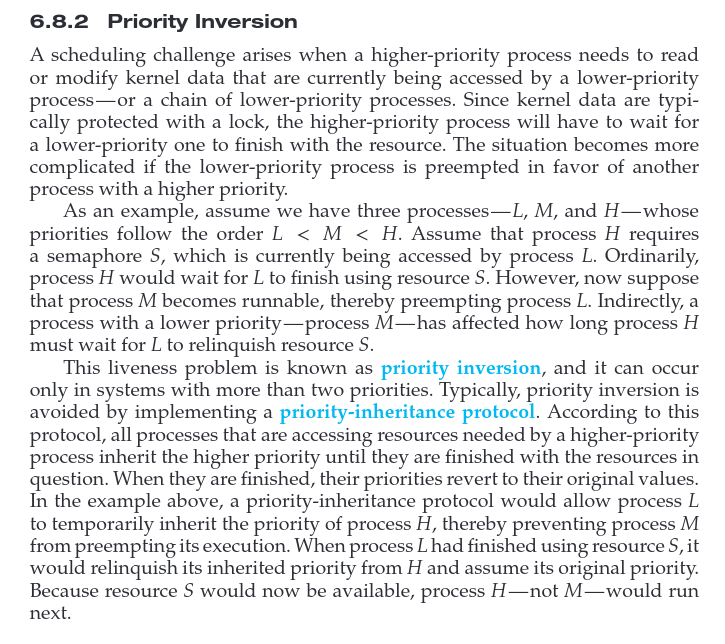
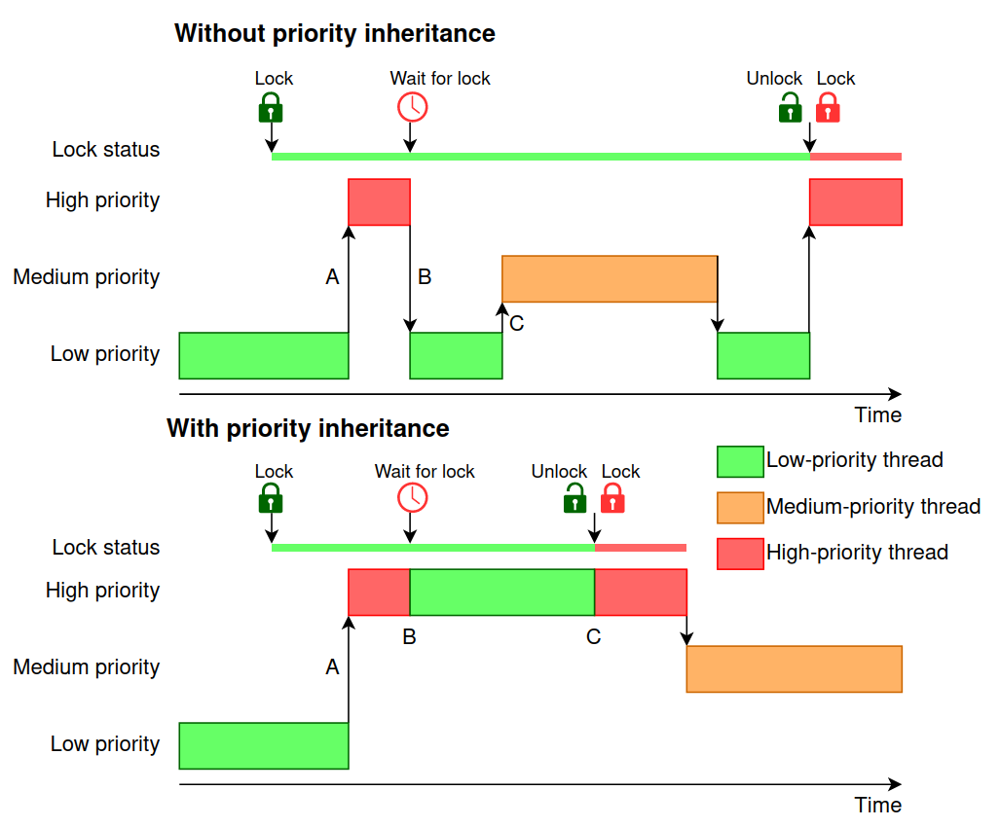

Take a quick glance [here](https://sirbuig.github.io/operating-systems/category/week-6) to refresh your concepts.

Some key concepts from the [Comet Book (yeah the one that killed the Dinosaurs, ha)](https://techiefood4u.wordpress.com/wp-content/uploads/2020/02/operating_systems_three_easy_pieces.pdf):

- A **critical section** is a piece of code that accesses a _shared_ resource, usually a variable or data structure.
- A **race condition** arises if multiple threads of execution enter the critical section at roughly the same time; both attempt to update the shared data structure, leading to a surprising (and perhaps undesirable) outcome.
- An **indeterminate** program consists of one or more race conditions; the output of the program varies from run to run, depending on which threads ran when. The outcome is thus not deterministic, something we usually expect from computer systems.
- To avoid these problems, threads should use some kind of **mutual exclusion** primitives; doing so guarantees that only a single thread ever enters a critical section, thus avoiding races, and resulting in deterministic program outputs.

## Requirements

:::tip

Remember that a solution to the **critical-section problem** must CHECK all these requirements:

1. **Mutual exclusion**. This property guarantees that if one thread is executing within the critical section, the others will be prevented from doing so.
2. **Progress**. If no process is in its critical section and some want to enter, the decision is made only by processes that are actively competing for entry, not those doing other tasks. This ensures that selection happens without indefinite delay.
3. **Bounded waiting**. A process that requests entry to its critical section will get in after a limited number of other processes have entered.

:::

## Solutions

### Peterson's Solution

Is discussed [here](https://sirbuig.github.io/operating-systems/week-6/critical-section#petersons-solution).

### Hardware Instructions

To ensure safe access to shared resources, we use atomic operations, meaning they execute without interruption. This improves performance and prevents race conditions.

However, implementing atomic execution for all instructions would require special hardware. Instead, we generalize the concept using specific atomic operations, such as:

- `test_and_set()`;
- `compare_and_swap()`.

This allows synchronization without requiring entirely new machine architectures.

Commented code to each of them can be found [here](https://sirbuig.github.io/operating-systems/week-6/critical-section#hardware-instructions).

`test_and_set()` is commonly used for implementing **simple locks**. It atomically **tests if a lock is already set** and then sets it, ensuring only one thread can acquire the lock at a time.

`compare_and_swap()` is used in **lock-free data structures** because it **compares a memory location with an expected value and swaps it if they match**. This allows for atomic updates of pointers in structures like lock-free stacks, queues, and linked lists.

`Lock-Free Example`: `compare_and_swap()` enables concurrent push and pop without a mutex, as seen in lock-free stacks. Since it avoids traditional locks, it is less susceptible to deadlocks and helps in high-performance, multi-threaded applications.

In the Dino Book (Figure 6.9, page 268) we are told `compare_and_swap()` does not meet the **bounded-waiting** requirement. However, we receive a solution for that:

```c title="bounded-waiting mutual-exclusion"
// elements in waiting are initialized to false
// lock is 0

// a process Pi can enter when waiting[i] == false
// OR
// key == 0

// Pi POV
while(true) { // while I want to enter the CS

    /* ENTRY SECTION */

    // 1. Declare interest in entering the CS
    waiting[i] = true; // Pi is now waiting

    // 2. Let's acquire the lock

    // the 'key' variable determines if the lock was
    // successfully acquired
    key = 1; // 1 means the lock is closed

    // loop loop loop until
    //  a) waiting[i] = false (we've been granted access from some other process)
    //  b) key becomes 0 aka lock is free
    while (waiting[i] && key == 1)
        // We attempt to set the lock from 0 to 1 atomically
        // lock is 0 (free) => key becomes 0 so the loop exits
        // lock is 1 (occupied) => key remains 1 so the loop continues
        key = compare_and_swap(&lock, 0, 1);

    // I no longer want to wait, I proceed into the CS
    waiting[i] = false;

    /* CRITICAL SECTION */


    /* EXIT SECTION */
    // I must allow another waiting process (if it exists) to guarantee fairness. So we're scanning the array in a cyclic order.

    // The next process following Pi
    j = (i+1) % n;

    // Keep scanning until we find a waiting process, otherwise loop back to Pi
    while ((j != i) && !waiting[j])
        j = (j+1) % n; // just the next process

    if (j == i)
        // We found no other process waiting
        // So we'll release lock
        lock = 0;
    else
        // We found a process waiting
        // We "hand over" the permission, by deactivating waiting and allowing Pj to exit its busy-wait loop and enter the CS
        waiting[j] = false;

    /* REMAINDER SECTION */
}
```

## Liveness

**Liveness** refers to a set of properties that a system must satisfy to ensure that processes make progress during their execution life cycle. A process waiting indefinitely under the circumstances just described is an example of a “liveness failure".

A very simple example of a liveness failure is an infinite loop. A **busy wait loop** presents the possibility of a liveness failure, especially if a process may loop an arbitrarily long period of time.

### Deadlock

Deadlock is covered [here](https://sirbuig.github.io/operating-systems/week-8/synchronization-examples/deadlock).

### Priority Inversion





## Further Reading

- [What really happened on Mars Rover Pathfinder](https://www.cs.cornell.edu/courses/cs614/1999sp/papers/pathfinder.html)
- [Real-Time Programming: Priority Inversion](https://picknik.ai/real-time/priority%20inversion/roscon/2024/01/31/Real-Time_Programming_Priority_Inversion.html)
- [Monitors - Neso Academy](https://www.youtube.com/watch?v=ufdQ0GR855M)

## References

- Operating Systems Concepts, 10th edition, Chapter 6 - Synchronization Tools
- Operating Systems - Three Easy Pieces, Part II - Concurrency
