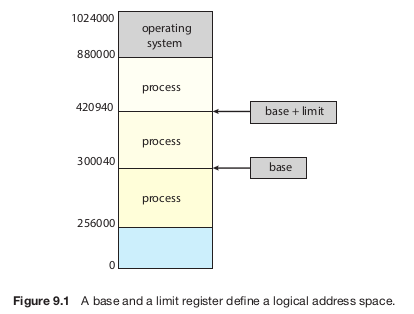
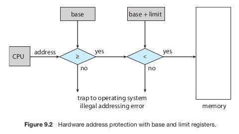
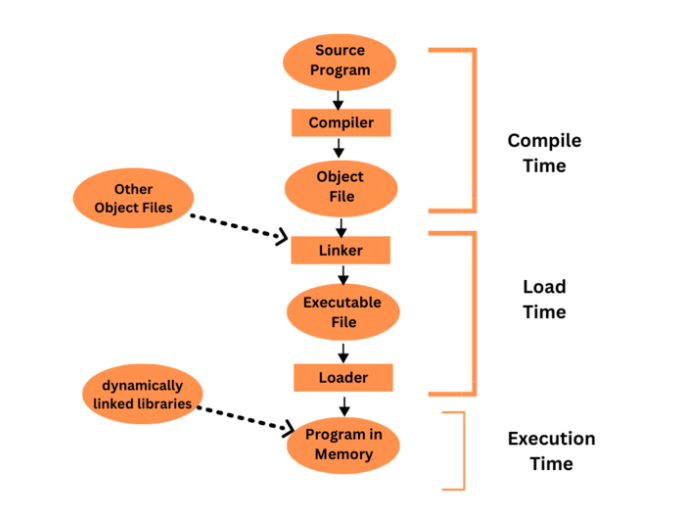
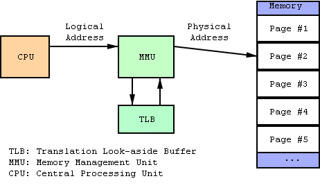
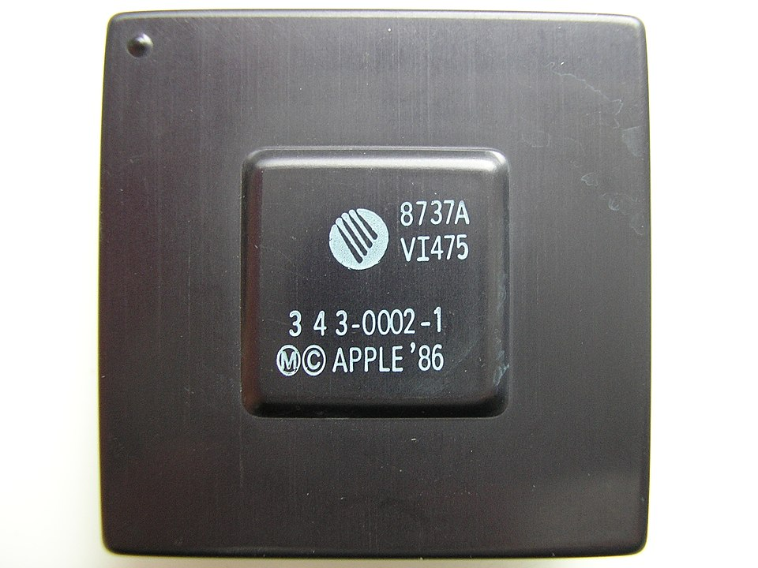
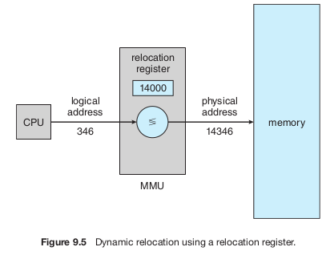

# Background

Remember that memory is central to the operation of a modern computer system. It consists of a large array of bytes, each with its own address.

The CPU fetches instructions that may cause additional loading and storing to specific memory addresses.

An **instruction-execution cycle** fetches an instruction from memory, the instruction is decoded and may cause operands to be fetched from the
memory. The instruction is executed on the operands and the result is stored back in memory.

Albeit an interesting sequence of events, **the memory unit** sees only a stream of memory addresses, it doesn't know a thing about what those
instructions are for or how they are generated. And this is why we usually ignore **how** a program generates a memory address, we only want to know
the sequence of memory addresses generated by the running program.

## Basic Hardware

The CPU can directly access only two types of general-purpose storage: **registers** (built into each CPU core) and **main memory**. Machine instructions can
use memory addresses, but not disk addresses. So, any instructions or data the CPU needs must be in registers or memory. If the data isn't in memory,
it has to be moved there before the CPU can use it.

Registers are extremely fast and accessible in just one CPU clock cycle. Some CPUs can even perform simple operations on register data within a single
tick. Main memory, however, is much slower and requires multiple clock cycles because it's accessed through the memory bus. This delay can cause the
CPU to **stall**, as it has to wait for the data it needs. Since frequent stalls would severely hurt performance, CPUs use **cache memory** — a smaller, faster
memory located on the CPU itself — to reduce delays. The hardware manages this cache automatically to speed up memory access, without needing the
operating system's help.

In addition to speed, we also need to ensure system security. The hardware must protect the operating system from being accessed by user processes
and also prevent user processes from interfering with one another. This protection is handled by hardware mechanisms to avoid slowing down the system,
as the operating system doesn't typically interfere with memory access directly.

To allow multiple processes to run at the same time, each process must have its own **separate memory space**. This isolation prevents processes from
interfering with one another. To enforce this, the system uses two special registers: a **base register** and a **limit register**. The base register holds
the starting address of the process's memory, while the limit register specifies how much memory the process can use. For example, if the base is
300040 and the limit is 120900, the process can access addresses from 300040 to 420939.

The CPU hardware checks every memory access in **user mode** against these registers. If a process tries to access memory outside its allowed range—whether
accidentally or on purpose—the hardware triggers a **trap** to the operating system, treating it as a serious error. This ensures a process cannot alter
the operating system's memory or other processes' data.

Only the operating system can modify the base and limit registers because they are updated using **privileged instructions**. These instructions can
only run in **kernel mode**, which is a special mode that only the operating system uses. This design ensures that user programs cannot tamper with
the registers.

In kernel mode, the operating system has full access to both its own memory and user memory. This capability is necessary for tasks like loading
programs into memory, handling errors, managing system calls, performing I/O operations, and providing other essential services.

## Address Binding

A program starts as a **binary executable file** stored on disk. To run, it is loaded into memory and set up as a **process**, making it ready for execution by the CPU. As the process runs, it fetches instructions and data from memory. When it finishes, the memory it used is freed for other processes.

Most systems allow processes to be loaded into **any part of physical memory**, so the starting address of a process doesn’t have to be 00000, even though the computer's memory address space might begin there. The operating system decides where to place each process in memory.

Before a program runs, it often goes through multiple steps, some optional. During these steps, **addresse**s are represented in different forms. In the source code, addresses are **symbolic**, like variable names (e.g., `count`). A compiler converts these to **relocatable addresses** (e.g., “14 bytes from the start of this module”). Finally, the linker or loader maps the relocatable addresses to **absolute addresses** (e.g., 74014). Each step involves translating addresses from one form to another.

Binding instructions and data to memory addresses can happen at different stages:

- **Compile Time**: If the memory location of a process is known at compile time, the compiler generates **absolute code** for that location. For example, if the process starts at address `R`, the compiler hardcodes instructions for that address. However, if the location changes later, the code must be recompiled.
- **Load Time**: If the process’s memory location isn’t known during compilation, the compiler generates **relocatable code**. The final memory binding happens when the process is loaded into memory. If the starting address changes, reloading the code is enough to update it.
- **Execution Time**: If a process can move between memory segments while running, binding is done **during execution**. This requires special hardware to handle address translation. Most modern operating systems use this method.

## Logical Versus Physical Address Space

The **CPU generates logical addresses**, while the **memory unit uses physical addresses** (the ones loaded into the memory-address register). If addresses are bound at **compile time** or **load time**, logical and physical addresses are the same. However, with **execution-time binding**, logical and physical addresses are different. In this case, logical addresses are often called **virtual addresses**, and we use the terms interchangeably.

A program's **logical address space** is the set of all logical addresses it can generate. Its **physical address space** consists of the physical memory locations corresponding to those logical addresses. With execution-time binding, these two spaces differ.

The conversion from virtual to physical addresses is handled at runtime by a hardware device called the **memory-management unit (MMU)**. One simple MMU scheme uses a **relocation register** (an upgraded version of the base register). When a process generates a logical address, the relocation register's value is added to it to get the physical address. For example, if the relocation register holds 14000, a logical address of 0 maps to physical address 14000, and a logical address of 346 maps to 14346.

The program itself never interacts with physical addresses. It works only with logical addresses (like 346), storing and manipulating them as needed. The memory-mapping hardware automatically converts these logical addresses to physical ones when the program accesses memory. This ensures the actual memory location is determined only when it’s accessed.

There are two types of addresses: **logical addresses** (ranging from 0 to `max`) and **physical addresses** (ranging from `R+0` to `R+max`, where `R` is the base value). A user program works only with logical addresses, assuming it runs in memory locations from 0 to `max`. However, these logical addresses must be translated to physical addresses before being used. The separation of **logical address space** and **physical address space** is key to effective memory management.
