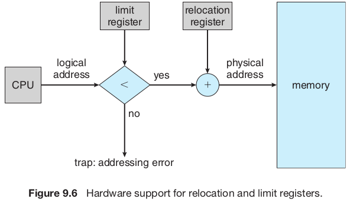

# Contiguous Memory Allocation

Main memory must hold both the **operating system** and **user processes**, so it needs to be allocated efficiently. One early method for this is **contiguous memory allocation**.

Memory is divided into two partitions: one for the operating system and one for user processes. The operating system can be placed in either **low memory** or **high memory**, depending on factors like the interrupt vector's location. Many operating systems, such as Linux and Windows, place the operating system in high memory, so we’ll focus on that setup.

To run multiple user processes simultaneously, we need to allocate memory for each process. In **contiguous memory allocation**, each process is assigned a single, continuous block of memory, located next to the memory block of the next process. Before diving deeper into this allocation method, we first need to discuss **memory protection**.

## Memory Protection

We can prevent a process from accessing unauthorized memory by using a **relocation register** and a **limit register** together. The relocation register holds the smallest physical address for the process, and the limit register defines the range of allowable logical addresses (e.g., relocation = 100040, limit = 74600). Every logical address generated by the process must fall within this range. The **MMU** dynamically adds the relocation value to the logical address to create the physical address, which is then sent to memory.

During a **context switch**, the dispatcher updates the relocation and limit registers for the selected process. Since all CPU-generated addresses are checked against these registers, this setup ensures the running process cannot access or modify the operating system or other users' memory.

The relocation-register scheme also allows the operating system to adjust its size dynamically. For instance, code and buffers for device drivers can be loaded into memory only when needed and removed afterward, freeing memory for other uses. This flexibility is particularly useful for optimizing memory usage.

## Memory Allocation

Memory allocation can be done using a **variable-partition scheme**, where processes are assigned to partitions of different sizes. Each partition holds exactly one process. The operating system maintains a table tracking which parts of memory are free and which are in use. Initially, all memory is available as one large block, called a **hole**. Over time, as processes enter and leave, memory becomes a mix of occupied sections and holes of various sizes.

For example, memory might start fully occupied with processes 5, 8, and 2. When process 8 leaves, a single hole appears. Later, process 9 is allocated memory. When process 5 exits, two noncontiguous holes are left.

When a process arrives, the operating system checks its memory needs against available holes. If a hole is large enough, it is split into two parts: one for the process and one for the remaining space, which goes back to the set of holes. When a process terminates, its memory is freed and returned to the holes. If adjacent holes are created, they are merged into a larger hole.

If there’s not enough memory for a process, the operating system can either reject it with an error message or place it in a wait queue. When memory becomes available, the system checks if the waiting process can now be accommodated.

This system is part of the broader dynamic storage-allocation problem, which focuses on finding space for processes efficiently. Common strategies include:

- **First-fit**: Use the first hole that is big enough.
- **Best-fit**: Use the smallest hole that fits the process.
- **Worst-fit**: Use the largest available hole.

:::tip

Simulations have shown that both first fit and best fit are better than worst
fit in terms of decreasing time and storage utilization. Neither first fit nor best
fit is clearly better than the other in terms of storage utilization, but first fit is
generally faster.

:::

## Fragmentation
