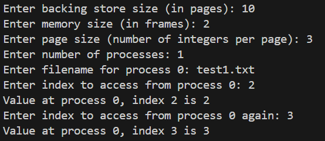
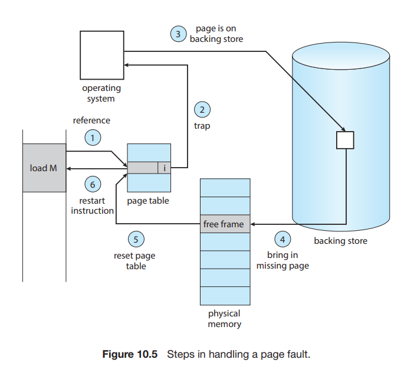

# Simulation of pagination in C

Create an app that simulates physical memory, backing store, page fault and LRU


:::important
Read [Chapter 9 Main Memory](https://os.ecci.ucr.ac.cr/slides/Abraham-Silberschatz-Operating-System-Concepts-10th-2018.pdf#page=455) and [Chapter 10 Virtual Memory](https://os.ecci.ucr.ac.cr/slides/Abraham-Silberschatz-Operating-System-Concepts-10th-2018.pdf#page=501) from the Operating System Concepts before trying to solve this problem.
This exercise is for learning about memory, don't use any generative AI tool to solve it.
:::
:::tip DOWNLOAD the provided [zip file](/downloads/page_problem.zip) containing the skeleton code.
:::


To run a process, we need more than just the code. It is also required a process control block, thread control block, a scheduler, 
a dispatcher, system calls to switch to kernel mode, a place in RAM to store data, and many more.

For our pagination simulation, we’ll work with:
- A process (list of integers)
- Physical memory
- Backing store
- Page table
- Frame map

## Task:

Implement a `get_value(process_id, index)` function that returns the integer at the given index for the specified process.
However, the process is split into pages and stored in a backing store. When `get_value` is called, we must check if the page is in memory:
- If not, load it into a free frame.
- If no frame is free, evict the least recently used (LRU) page and load the necessary one.

**All data must be accessed through the physical memory simulated.**  
**The exercise is made just for reading the data.**

Complete the three functions found at the of the `memory.c`:
- handle_page_fault
- get_value
- update_lru

## Optional:
Create a function that writes in the memory. Make sure to change handle_page_fault to write data frame into the backing store.

### Input
- `BACKING_STORE_SIZE` (max pages in the backing store)
- `MEMORY_SIZE` (number of frames in memory)
- `PAGE_SIZE` (integers per page)
- `NUM_PROCESSES` (number of processes)
- For each process, a filename containing its list of integers.

### Example
Given a file `test1.txt`:
```text
0 1 2 3 4 5 6 7 8 9
```

Compile and run:
```bash
gcc -o program main.c process.c backing_store.c memory.c
./program
```

You will see an output similar to the provided image after you finish the problem.



To run tests:
```bash
gcc -o test memory.c process.c backing_store.c test.c
./test
```

## Skeleton explanation

<details>
<summary><i>How do we store the data?</i></summary>

All the structures from the code:
```c title="config.h"
// Page Table Entry
typedef struct {
    int frame_number;
    bool valid; 
    // For LRU, we might store a 'last_used' counter or timestamp here or separately.
    unsigned long last_used;
} page_table_entry;

// Process Structure
typedef struct {
    int process_id;
    int *data;               // Array of integers read from file
    int data_count;          // How many integers in this process
    int pages_count;         // How many pages the process has
    page_table_entry *page_table;
} Process;

// Backing Store Page
typedef struct {
    int process_id;
    int page_number;
    int *page_data;   // array of integers of size page_size
} BackingStorePage;

// We'll need a reverse mapping: frame -> which process/page is currently held there
typedef struct {
    int process_id;
    int page_number;
} FrameMap;

```
Global data:
```c title="config.h"

// Global configuration variables
extern int BACKING_STORE_SIZE; // number of pages total in backing store (input by user)
extern int MEMORY_SIZE;        // number of frames in physical memory (input by user)
extern int PAGE_SIZE;          // number of integers per page (input by user)
extern int NUM_PROCESSES;      // number of processes

// Arrays / Global pointers
extern Process *processes; 
extern BackingStorePage *backing_store; 
extern int **physical_memory;  // physical_memory[i] is an array of int[PAGE_SIZE] representing a frame

// For LRU, we will have a global counter to track "time" or accesses
extern unsigned long global_time_counter;
```
</details>

<details>
<summary><i>How do we create a process?</i></summary>

The code is in the `process.c`

Pseudocode is like this:
- create an object process and assign an id to it
- open the file
- simulate a stl mechanism and add here the numbers. (allocate dynamically a fixed size and if it is full, reallocate double the current size)
- calculate data_count, pages_count (make sure to calculate the internal fragmentation)
- allocate memory to page_table and initialize each value as followed:
  - frame_number = -1
  - valid = false
  - last_used = 0 (useful for LRU, if a page has the smallest number, it is the least used)
</details>

<details>
<summary><i>How do we create the backing store?</i></summary>

The code is in the `backing_store.c`

Pseudocode for create_backing_store() which is created one time after we know the page size and before get_value:
- see how many pages we need to satisfy the size of the processes and exit if we don't have enough space
- allocate space for the backing store (using the struct BackingStorePage)
- Get each process and put them into the backing store:
  - be careful with (the copy of the *data into the page_data. You can use the base + limit technique from chapter 9)
  - be careful with the internal fragmentation (allocate as 0)

Pseudocode for load_page_from_backing_store which is used to load from backing store to the main memory:
- get the page number and process_id (because we have some metadata in the backing store)
- find the page with those numbers
- copy to the frame
- Make sure to check if it is not found a page.


</details>

<details>
<summary><i>How do we create the main memory and how do we get the frame number?</i></summary>

The code is in the `memory.c`

Pseudocode for init_physical_memory() appellation after creating the backing store:
- allocate memory (MEMORY_size of pointers)
- allocate for each block (PAGE_SIZE of integers)
- create the frame map (we need to know what process and page_number are in each frame)

Pseudocode for get_frame_for_page() which returns the frame number where it is located:
- find the process with that id (any search algorithm)
- get the page table
- Important to update the appearance for LRU detection
- return the frame number for which corresponds to the page (if it is valid)
- if it is not valid, the data is not in memory, and we return -1, which causes a page fault.
</details>

<details>
<summary><i>How do we select the frame that should be deleted with the LRU algorithm?</i></summary>

The code is in the `memory.c`

**Idea for select_victim_frame():**   
We have a global value: global_time_counter. Each time we add a new frame to the main memory `OR` 
we access a frame from the memory we add +1 to this variable, 
thus the frame with the smallest number is the least used one. 

</details>


## Tips for the functions

<details>
<summary><i>💡 handle_page_fault</i></summary>

When a page is not in the main memory, the handle_page_fault should be triggered in the get_value. Remember that
we can see if a page is not in a frame with get_frame_for_page() == -1.

This function should:
- find a free frame 
  - if it is not found `select a victim frame`
    - see what process and page is in that frame 
    - change the page_table of that process (the valid number and the frame number)
    - now you have a free frame
  
- Now load from the backing store the page itself
- Update in the end the page table of the process and the frame map.

As a visual representation, look at the following image:

</details>

<details>
<summary><i>💡 get_value</i></summary>

In the end, the function should return the value requested by the user (the value from an index)

The function should:
- calculate the page number and offset.
- Find the process
- Verify if the process exists (use: exit(2);)
- Verify if the user wants to access a value out of its range (use: exit(3);)
- `get the frame number from process page table` (you have a function for this)
- Make sure to verify if there is a page fault
- return directly from the memory value (physical_memory[frame][offset])
</details>

<details>
<summary><i>💡 update LRU</i></summary>

Find where the function is needed.

**Idea:** add +1 to the global_time_counter to the page from the process given.
</details>

## Solution
<details>
<summary><i>Check only, don't cheat 😠</i></summary>

```c 

void handle_page_fault(int process_id, int page_number) {
    // Need to find a free frame or evict a victim
    int frame = find_free_frame();
    if(frame == -1) {
        // No free frame, select victim
        frame = select_victim_frame();
        // Evict victim
        int vic_proc = frame_map[frame].process_id;
        int vic_page = frame_map[frame].page_number;
        // Mark that page table entry as invalid
        // Find that process
        Process *vproc = NULL;
        for(int i=0; i<NUM_PROCESSES; i++){
            if(processes[i].process_id == vic_proc) {
                vproc = &processes[i];
                break;
            }
        }
        vproc->page_table[vic_page].valid = false;
        vproc->page_table[vic_page].frame_number = -1;
    }

    // Load the requested page into this frame
    load_page_from_backing_store(process_id, page_number, physical_memory[frame]);
    // Update page table entry
    Process *p = NULL;
    for(int i=0; i<NUM_PROCESSES; i++){
        if(processes[i].process_id == process_id) {
            p = &processes[i];
            break;
        }
    }
    p->page_table[page_number].valid = true;
    p->page_table[page_number].frame_number = frame;
    p->page_table[page_number].last_used = ++global_time_counter;

    // Update frame map
    frame_occupied[frame] = true;
    frame_map[frame].process_id = process_id;
    frame_map[frame].page_number = page_number;
}

int get_value(int process_id, int logical_index) {
    // Determine which page and offset
    int page_number = logical_index / PAGE_SIZE;
    int offset = logical_index % PAGE_SIZE;

    // Ensure page_number < process_pages_count
    Process *p = NULL;
    for(int i=0; i<NUM_PROCESSES; i++){
        if(processes[i].process_id == process_id) {
            p = &processes[i];
            break;
        }
    }
    if(!p) {
        fprintf(stderr,"Process %d not found\n", process_id);
        exit(2);
    }

    if(page_number >= p->pages_count) {
        fprintf(stderr,"Access out of range (process %d, index %d)\n", process_id, logical_index);
        exit(3);
    }

    int frame = get_frame_for_page(process_id, page_number);
    if(frame == -1) {
        // Page fault
        handle_page_fault(process_id, page_number);
        frame = p->page_table[page_number].frame_number;
    }

    return physical_memory[frame][offset];
}

void update_lru(int process_id, int page_number) {
  //  Just update the last_used to current global_time_counter
    Process *p = NULL;
    for(int i=0; i<NUM_PROCESSES; i++){
        if(processes[i].process_id == process_id) {
            p = &processes[i];
            break;
        }
    }
    p->page_table[page_number].last_used = ++global_time_counter;
}
```
</details>

## What we learned:
We learned how the pagination works, and how we can manage a process that has more pages than frames available in RAM.
Moreover, a concept seen in the code is `Thrashing`. 

Look at the get_value function and observe that if we don't have 
the page in the memory, there is a page_fault. If every value we call with get_value is on a different page, we will do a
page fault every time, thus handle_page_fault() will be called when we want a value from memory, which is costly.

