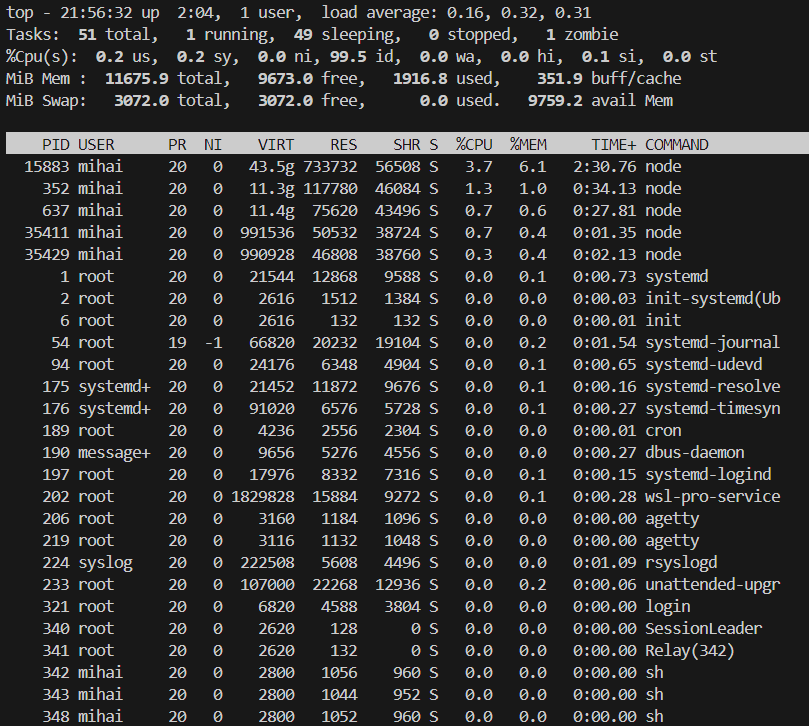

# Syscalls you didn't know
What power do you really have with your terminal?

We all know about Task manager, "who" never leave us at hard times, where you can observe 
how powerful is your PC and where you "End task" (kill) processes. 

The question is, can you find more?? And the answer is yes, actually a lot of stuff 
that are not important but cool to see. `That is the topic for this page: find more`. 

Jokes aside, most of the information provided on this page will strengthen your understanding
in operating system principles, and it will be easier later to grasp new information.

## vmstat

- Information about block IO and CPU activity in addition to memory.

let's run this in terminal (Linux) that runs vmstat 5 times with a delay of 1 second
```shell
vmstat 1 5
```


<details>
<summary><i>What represents each information ? </i></summary>

- **Procs**
    - `r`: The number of processes waiting for run time.
    - `b`: The number of processes in uninterruptible sleep.
- **Memory**

    - `swpd`: the amount of virtual memory used.
    - `free`: the amount of idle memory.
    - `buff`: the amount of memory used as buffers.
    - `cache`: the amount of memory used as cache.
    - `inact`: the amount of inactive memory. (-a option)
    - `active`: the amount of active memory. (-a option)
- **Swap**

    - `si`: Amount of memory swapped in from disk (/s).
    - `so`: Amount of memory swapped to disk (/s).
- **IO**
    - `bi`: Blocks received from a block device (blocks/s).
    - `bo`: Blocks sent to a block device (blocks/s).
- **System**
    - `in`: The number of interrupts per second, including the clock.
    - `cs`: The number of context switches per second.
- **CPU**  
  These are percentages of total CPU time.
    - `us`: Time spent running non-kernel code. (user time, including nice time)
    - `sy`: Time spent running kernel code. (system time)
    - `id`: Time spent idle. Prior to Linux 2.5.41, this includes IO-wait time.
    - `wa`: Time spent waiting for IO. Prior to Linux 2.5.41, included in idle.
    - `st`: Time stolen from a virtual machine. Prior to Linux 2.6.11, unknown.
</details>

<details>
<summary><i>How to use this command</i></summary>

`usage: vmstat [-V] [-n] [delay [count]]`   
-V prints version.   
-n causes the headers not to be reprinted regularly.  
-a print inactive/active page stats.   
-d prints disk statistics  
-D prints disk table  
-p prints disk partition statistics  
-s prints vm table  
-m prints slabinfo  
-S unit size   
delay is the delay between updates in seconds.  
unit size k:1000 K:1024 m:1000000 M:1048576 (default is K)   
count is the number of updates.  

</details>

## IOSTAT -h

> "The iostat command monitors system input/output device load by observing the time that the devices are active in relation to their average transfer rates.
> The iostat report shows:   
> CPU utilization   
> Device queue information   
> Service time  
> " wrote by IBM

```shell
iostat -h
```


<details>
<summary><i>What represents each information ?</i></summary>

`%user`  Show  the  percentage  of CPU utilization that occurred while executing at the user level (application).

`%nice`  Show the percentage of CPU utilization that occurred while  executing  at  the user level with nice priority.

`%system`Show  the  percentage  of CPU utilization that occurred while executing at the system level (kernel).

`%iowait` Show the percentage of time that the CPU or CPUs were idle  during  which  the system had an outstanding disk I/O request.

`%steal` Show  the  percentage  of time spent in involuntary wait by the virtual CPU or CPUs while the hypervisor was servicing another virtual processor.

`%idle`  Show the percentage of time that the CPU or CPUs were idle and the system  did not have an outstanding disk I/O request.

`Device` : The device/partition name is listed in /dev directory.   
`tps` : The number of transfers per second that were issued to the device. Higher tps means the processor is busier.   
`Blk_read/s` : It shows the amount of data read from the device expressed in a number of blocks (kilobytes, megabytes) per second.   
`Blk_wrtn/s` : The amount of data written to the device expressed in a number of blocks (kilobytes, megabytes) per second.   
`Blk_read` : It shows the total number of blocks read.   
`Blk_wrtn` : It shows the total number of blocks written.  


`hdX` — ATA hard disk, pre-libata. You'll only see this with old distros (probably based on Linux 2.4.x or older)
`sdX` — "SCSI" hard disk. Also includes SATA and SAS. And IDE disks using libata (on any recent distro).
`hdXY, sdXY` — Partition on the hard disk hdX or sdX.
`loopX` — Loopback device, used for mounting disk images, etc.
`loopXpY` — Partitions on the loopback device loopX; used when mounting an image of a complete hard drive, etc.
`scdX, srX` — "SCSI" CD, using same weird definition of "SCSI". Also includes DVD, Blu-ray, etc.
`mdX` — Linux MDraid
`dm-X`— Device Mapper. Use -N to see what these are, or ls -l /dev/mapper. Device Mapper underlies LVM2 and dm-crypt. If y

**Easter egg : run the command iostat -p ALL -h**

</details>

## TOP
The top utility is a commonly used tool for displaying system-performance information. 
It dynamically shows administrators which processes are consuming processor and memory resources.



> I intentionally created a zombie process to see here the info 

<details>
<summary><i>What represents each information ?</i></summary>

- us is the percent of time spent running user processes.
- sy is the percent of time spent running the kernel.
- ni is the percent of time spent running processes with manually configured nice values.
- id is the percent of time idle (if low, CPU may be overworked).
- wa is the percent of wait time (if high, CPU is waiting for I/O access).
- hi is the percent of time managing hardware interrupts.
- si is the percent of time managing software interrupts.
- st is the percent of virtual CPU time waiting for access to physical CPU.   

mebibyte (and similar units, such as kibibytes and gibibytes) differs slightly from measurements such as megabytes. Mebibytes are based on 1024 units, and megabytes are based on 1000 units (decimal).

- PID: Shows task’s unique process id.
- PR: The process’s priority. The lower the number, the higher the priority.
- VIRT: Total virtual memory used by the task.
- USER: User name of owner of task.
- %CPU: Represents the CPU usage.
- TIME+: CPU Time, the same as ‘TIME’, but reflecting more granularity through hundredths of a second.
- SHR: Represents the Shared Memory size (kb) used by a task.
- NI: Represents a Nice Value of task. A Negative nice value implies higher priority, and positive Nice value means lower priority.
- %MEM: Shows the Memory usage of task.
- RES: How much physical RAM the process is using, measured in kilobytes.
- COMMAND: The name of the command that started the process.

</details>

Those are just a few of them, but just remember "you can access more information than you think".

### References 
- https://access.redhat.com/solutions/1160343
- https://man7.org/linux/man-pages/man1/iostat.1.html
- https://www.redhat.com/en/blog/interpret-top-output

- https://stackoverflow.com/questions/25172425/create-zombie-process
