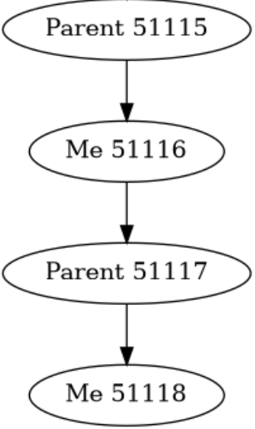
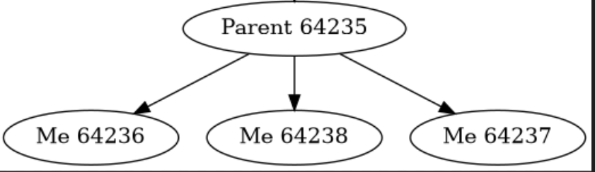
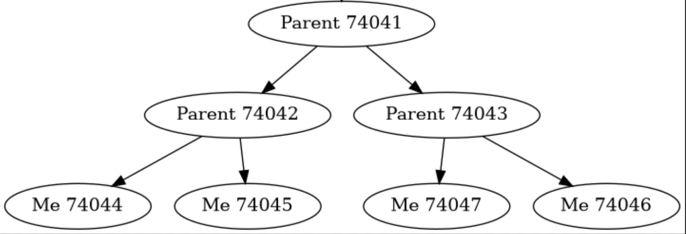
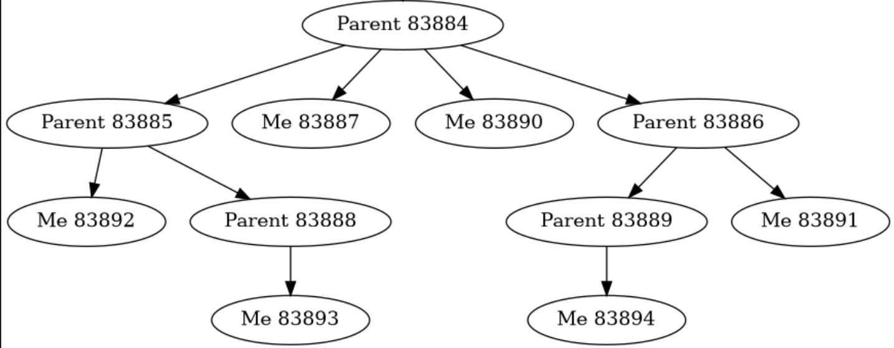
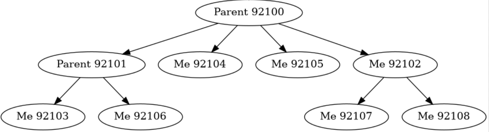
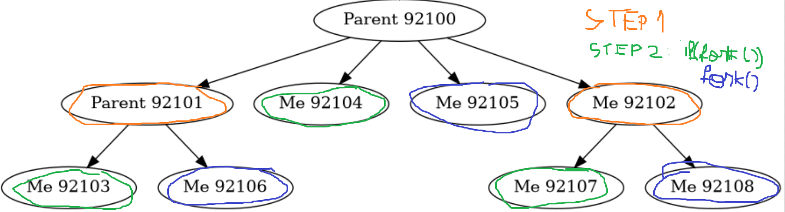
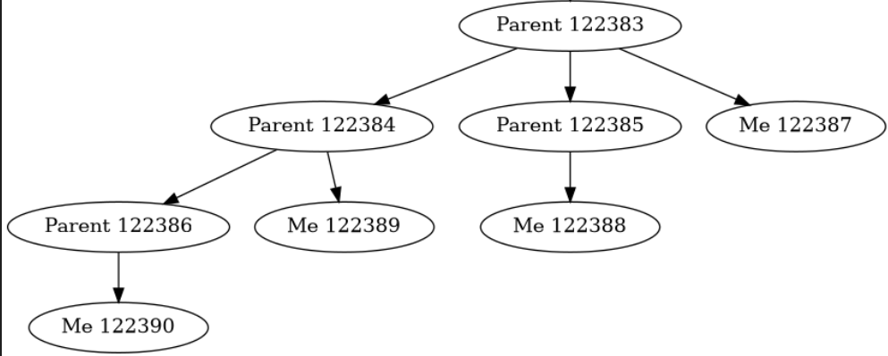
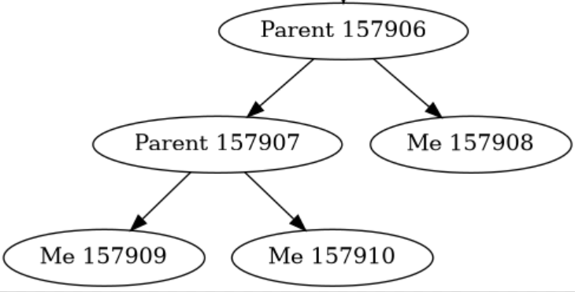

# Understand the process creation

Concept, motivation, code, examples

## Definition

- fork() is the primary method of process creation of an operating system like Unix.

The newly created process is known as the `Child process`, and the process from which the child process is created is known as the `Parent process`.

- The C fork() function returns a **negative value** when the function fails to create a child process.

- The C fork() function returns a **zero value** to the child process that is newly created. On successful duplication of a process,
  the PID of the child process is returned in the parent, and 0 is returned in the child process.

- The C fork() function returns a **positive value** to the parent process or the caller. The positive value consists of the process ID of that particular child process that is being created.

How to get the pid:

```c
pid_t pid = fork();
```

## Why do we want to create processes

Let's see some practical applications of fork:

1. Shell uses fork to run programs that you invoke from cmd.
2. Web servers like apache use fork to create multiple server processes, each of which handles requests in its own address space.
3. Google Chrome uses fork to handle each page within separate process. See more on [further reading](#further-reading)
4. When you want to isolate parts of the applications and if they crash/ leak memory/ misbehave, they can be killed/restarted without killing entire application
5. By hackers (put here for learning purposes): Fork bomb
6. Used in pipes, two processes that work together. Send information to each other.

## How is it in code

```c
#include <stdio.h>
#include <sys/types.h>
#include <unistd.h>
int main()
{
    fork();
    printf("Hello world!\n");
    return 0;
}
```

Output:

```shell
Hello world!
Hello world!
```


In the example above, what is below the fork will be copied to the new process (child) and will be executed.
So, `printf` will be run by parent and child.

<details>
<summary><i>🍵 Coffee break with some memes</i></summary>


</details>

## Sample for code visualization

Before getting deeper, there is a sample code we will give you. It will generate an image based on what processes are created in a C file.

**Prerequisites** : Download `graphviz` on your machine.

**Usage** :

1. Create a file named `forks.log`
2. Run the `script.py` code in a separate terminal
3. Run the `template.c`

```python title="script.py"
import os
import time
import graphviz

log_file_path = 'forks.log'

dot = graphviz.Digraph(comment='Forks')

def update_graph():
    global dot
    dot = graphviz.Digraph(comment='Forks')

    with open(log_file_path, 'r') as file:
        lines = file.readlines()

    for line in lines:
        if line.strip():
            parts = line.split()
            parent = parts[1]
            child = parts[3]
            dot.node(parent, f'Parent {parent}')
            dot.node(child, f'Me {child}')
            dot.edge(parent, child)

    output_filename = 'forks_graph'
    dot.render(output_filename, format='png')
    print(f"Graph updated and saved as {output_filename}.png")


def monitor_log():
    if not os.path.exists(log_file_path):
        print(f"No log file found at {log_file_path}")
        return
    last_size = os.path.getsize(log_file_path)
    while True:
        update_graph()
        time.sleep(3)


if __name__ == "__main__":
    monitor_log()
```

```c title="template.c"
#include <stdio.h>
#include <unistd.h>
#include <sys/types.h>
#include <sys/wait.h>
#include <stdlib.h>
void clear_log() {
    FILE *log_file = fopen("forks.log", "w");
    if (log_file != NULL) {
        fclose(log_file);
    }
}

void log_fork(pid_t parent, pid_t child) {
    FILE *log_file = fopen("forks.log", "a");
    if (log_file != NULL) {
        fprintf(log_file, "Parent %d Me %d\n", parent, child);
        fclose(log_file);
    }
}

int main() {
    clear_log();

    // Try me
    // fork();

    log_fork(getppid(), getpid());
    return 0;
}
```

## Examples

### Part 1 - Show the picture, recreate the code

**Exercise 1:**



<details>
<summary><i>💡Solution</i></summary>

```c
if(!fork()){
    if(!fork()){
        fork();
    }
}
```

Explanation:
First, the first `fork()` is done, then `if(!fork())` means that the code continues if we are in the child process.

</details>

**Exercise 2**



<details>
<summary><i>💡Solution</i></summary>

```c
if(fork()){
    if(fork()){
        fork();
    }
}
```

Explanation:
First, the first `fork()` is done, then `if(fork())` means that the code continues if we are in the parent process.

</details>

**Exercise 3:**



<details>
<summary><i>💡Solution</i></summary>

```c
if(!fork()){
    if(fork()){
        fork();
    }
}else{
    if(!fork()){
        if(fork()){
            fork();
        }
    }
}
```

</details>

**Exercise 4 (try to solve it and then verify the solution with the [sample code](#sample-for-code-visualization))**



### Part 2 - Having the code, create the image

**Exercise 1**

```c
for(int i = 0; i < 2; i ++){
    if(fork()){
        fork();
    }
}
```

<details>
<summary><i>💡Solution</i></summary>



Explanation:


</details>

**Exercise 2**

For this one, find what it looks like, but also **what is the formula** to calculate how many new processes are created for any `n` given.

```c
int n = 2;
for(int i = 0; i < n; i ++){
    for(int j = i; j >= 0; j --){
        fork();
    }
}
```

<details>
<summary><i>💡Solution</i></summary>



Formula: 2^(n \* (n + 1) / 2) - 1

Human form:
2^(how many forks are made) - (the main process which is not new)

</details>

**Exercise 3**

```c
if(fork() || fork()){
    fork();
}
```

<details>
<summary><i>💡Solution</i></summary>



This one is tricky. First it does the fork() and now we have the parent and the child.
The parent returns something > 0 and the child returns 0. The `||` goes to the next element if we have false on the first argument
(this is called Short-circuit evaluation). So for the child it will do a `fork()`.

The last fork is done for each parent from the if statement. We have (1 || 0), (0 || 1).

If it is not yer clear, try with more forks in the if statement. For example `if(fork() || fork() || fork() )`

</details>

**Exercise 4 (try yourself now and verify with the [sample code](#sample-for-code-visualization))**

```c
if(fork() && (!fork())){
    if(fork() || fork()){
        fork();
    }
}
```

## Use fork in problems

Let's create a simple problem. We want to printf for n times "Hello world" and for each print we will use a child.

```c title="multi-process hello world"
#include <dirent.h>
#include <stdio.h>
#include <errno.h>
#include <unistd.h>
#include <sys/wait.h>
#include <stdlib.h>


int main(int argc, char *argv[]){
    //we create n processes
    for(int i = 1; i <= atoi(argv[1]); i ++){
        int pid = fork();
        if (pid < 0){
            return errno;
        }
        else if (pid == 0){
            //kiddo
            printf("Hello world, %d\n", i);
            printf("Done Parent %d Me %d\n", getppid(), getpid());

           return 0; //The child kills himself
        }
    }
    //we wait after n processes
    for(int i = 1; i <= atoi(argv[1]); i ++){
        wait(NULL);
    }

    return 0;
}
```

At each iteration, we will do a fork and create a child which does what he needs to do and then returns `0`.  
The intuition is that we will have `2^n` processes, but in fact we will have `n` processes because of `return 0`.

To ensure that our processes run in parallel, we need to do the last `for` (waiting `n` times). If we had put the `wait` command inside the first `for` loop, the processes would not run in parallel.

## Further Reading

- https://blog.chromium.org/2008/09/multi-process-architecture.html

## References

- https://stackoverflow.com/questions/985051/what-is-the-purpose-of-fork
- https://stackoverflow.com/questions/5839519/motivation-for-spawning-a-new-process-v-thread
- https://www.scaler.com/topics/c-fork/
- https://en.wikipedia.org/wiki/Pipeline_(Unix)
- https://en.wikipedia.org/wiki/Fork_bomb
- https://www.geeksforgeeks.org/fork-practice-questions/
