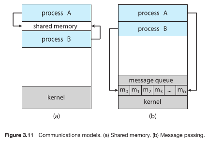

# Inter-process communication

Processes executing concurrently can be either **independent** or **cooperating**.

An **independent process** does not share any data with the other executing processes.

A **cooperating process** affects or is affected by the other processes executing in the system.

:::note

Any process that shares data with other processes is a cooperating process.

:::

### Reasons

TODO

### What is IPC?

Because cooperating processes affect one another, they must "communicate" (in their own technical way), and this is called **IPC**, or **inter-process communication**.

There are 2 ways to do this: either by having a **shared memory**, which means that a region of memory is established by the cooperating process and then used as a "medium" for information exchange, or by **message passing**.

### Shared memory model

IPC using shared memory requires a region of _shared memory_.
