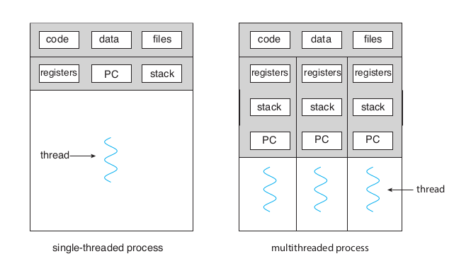
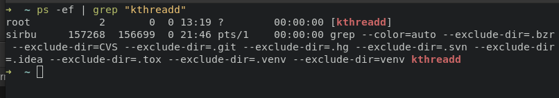
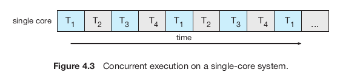
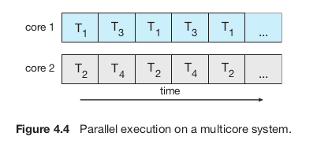

# Threads

## Overview

A thread is a basic unit of CPU utilization, comprising of:

- thread ID
- program counter (PC)
- register set
- stack

However, it shares with the other threads of the same process its code section, data section, open files etc.



Most operating system kernels are multithreaded. Linux creates on boot several kernel threads performing a specific task (device management, memory managemenet etc).

:::tip

With the command `ps -ef` you can see the kernel threads on a running Linux system. Amongst them, `kthreadd` (`pid` = 2) serves as the parent of all other kernel threads.



:::

## Multicore programming

Over time, single-CPU systems evolved into multi-CPU systems. Now the trend is to place multiple computing cores on a single processing chip, with each core appearing as a separate CPU to the OS. This system is called a **multicore system**, and here is where multithreaded programming really shines.

One a single computing core (capable of executing only one thread at a time), concurrency means only the fact that the threads will be interleaved over time.



On a multicore system, with the system assigning a thread to each core, some threads can run in parallel.



:::note

There is a distinction between **concurrency** and **parallelism**!

A **concurrent** system supports more than one task by allowing all the tasks to make progress.

A **parallel** system can perform more than one task simultaneously.

So, concurrency can be done without parallelism, and in fact when computers had only a single processor the CPU schedulers were designed to provide the illusion of parallelism by rapidly switching between processes, resulting in each process making progress.

:::

## Threads using POSIX API in Linux

Linux uses `pthreads` for thread creation and synchronization.

:::tip

Remember to compile and link programs with `-pthread`.

:::

### `pthread_create()`

```
int pthread_create(pthread_t *thread, const pthread_attr_t *attr, void *(*start_routine) (void *), void *arg);
```

This function starts a new thread in the calling process. The new thread starts execution by invoking `start_routine()` with `arg` being the sole argument of the routine!

`attr` points to a `pthread_attr_t` structure whose contents are used at creation time to determine attributes for the new thread. When `attr` is **NULL**, the thread is created with default attributes.

A successful call to `pthread_create()` stores the ID of the new thread in the buffer pointer to by `thread` and this identifier is used to refer to the thread in subsequent calls.

### `pthread_join()`

```
int pthread_join(pthread_t thread, void **retval);
```

This function waits for the thread specified by `thread` to terminate. If that thread has already terminated, then `pthread_join()` returns immediately.

If `retval` is not NULL, `pthread_join()` copies the value that the target thread supplied to `pthread_exit()` into the location pointed by `retval`.

## Further Reading

- [What’s the Diff: Programs, Processes, and Threads](https://www.backblaze.com/blog/whats-the-diff-programs-processes-and-threads/)
- [FAANG Interview Question | Process vs Thread](https://youtu.be/4rLW7zg21gI?feature=shared)
- [Neso Academy - Introduction to Threads](https://youtu.be/LOfGJcVnvAk?feature=shared)
- [Concurrency is not Parallelism by Rob Pike](https://youtu.be/oV9rvDllKEg?feature=shared)

## References

- Operating Systems Concepts, 10th edition, Chapter 4 - Threads & Concurrency
- [Linux man pages](https://man7.org/linux/man-pages/index.html)
- [Laboratory 6](https://cs.unibuc.ro/~pirofti/so/so-lab-6.pdf)
