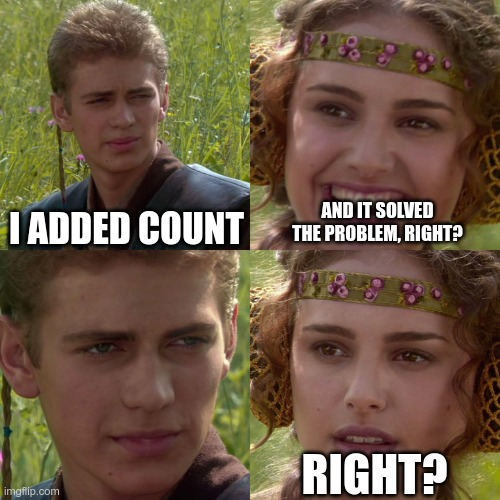
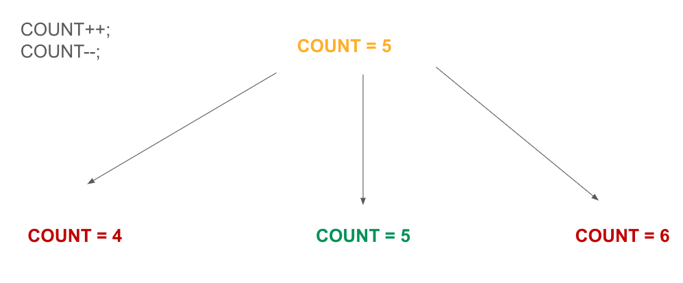
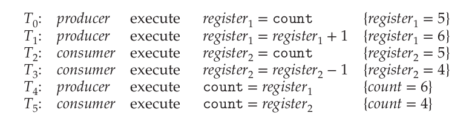

# Process Synchronization Background

A system typically consists of several (perhaps hundreds or even thousands) of threads running either concurrently or in parallel. As we saw in the last chapter about threads, they share user data.

When the shared data is not controlled, corrupt data values may appear, this phenomenon being called a **race condition**.

## Producer-Consumer problem

:::note

Do you remember what a cooperating process was?

If not, see [last week's chapter](http://localhost:3000/operating-systems/week-5/ipc).

:::

To illustrate the concept of cooperating processes, let's consider the **producer-consumer** problem, a common paradigm for cooperating processes.

A **producer** process produces information that is consumed by a **consumer** process.

One solution to this problem involves shared memory, a concept introduced in the last chapter, as well. To allow both producer and consumer processes to run concurrently, we must have a viable buffer of items that can be **filled by the producer** and **emptied by the consumer**.

The buffer will be the region of memory that will be shared.

We want the producer and consumer to be **synchronized** so that the consumer does not try to consume an item that has not yet been produced!

### Shared memory approach

1. Let's define our **bounded buffer** (in this case the consumer must wait if the buffer is empty, and the producer must wait if the buffer is full), our item and the variables `in` and `out`.

```c
// fixed buffer size
#define BUFFER_SIZE 10

// we define our item
typedef struct {
    // ...
} item;

// circular array with 2 logical pointers, in and out
item buffer[BUFFER_SIZE];

// in points to the next free position in the buffer
int in = 0;

// out points to the first full position of the buffer
int out = 0;
```

:::note

The buffer is **empty** when `in == out`.

The buffer is **full** when `((in + 1) % BUFFER_SIZE) == out`.

:::

2. Now let's implement the producer:

```c
item next_produced;

while(true) {
    /* produce an item in next_produced */

    // if the buffer is full, do nothing
    while( ((in + 1) % BUFFER_SIZE) == out)
        ;

    // otherwise, add the produced item in the buffer
    buffer[in] = next_produced;
    // calculate the next "pointer" to the free position
    in = (in + 1) % BUFFER_SIZE;
}
```

3. The consumer, as well:

```c
item next_consumed;

while(true) {
    // if the buffer is empty, do nothing
    while (in == out)
        ;

    // select the item to consume
    next_consumed = buffer[out];
    // calculate the next "pointer" to the full position
    out = (out + 1) % BUFFER_SIZE;

    /* consume the item in next_consumed */
}
```

:::tip

The buffer is **circular**, with `in` and `out` "chasing" each other. Watch this [excellent short video](https://youtu.be/VXJSJ6c3ZIs?feature=shared) for more.


:::

:::danger THINK ABOUT IT!

Do you think this illustration is fully correct?

How many items can we have at most in our buffer?

:::

Although the code above is correct, we have a little setback. Only `BUFFER_SIZE-1` elements are allowed in the buffer (take a pen and paper and see it for youself)!

### Adding `count`

To solve this, we can add a variable `count = 0;`

We'll **increment**, `count++`, when adding a new item to the buffer and **decrement**, `count--`, when removing one item from the buffer.

1. New Producer

```c
item next_produced;

while(true) {
   /* produce an item in next_produced */

   // if the buffer is full, do nothing
   while( count == BUFFER_SIZE )
       ;

   // otherwise, add the produced item in the buffer
   buffer[in] = next_produced;
   // calculate the next "pointer" to the free position
   in = (in + 1) % BUFFER_SIZE;
   count++;
}
```

2. New Consumer

```c
item next_consumed;

while(true) {
   // if the buffer is empty, do nothing
   while (count == 0)
       ;

   // select the item to consume
   next_consumed = buffer[out];
   // calculate the next "pointer" to the full position
   out = (out + 1) % BUFFER_SIZE;
   count--;
   /* consume the item in next_consumed */
}
```

Super, now everything makes even more sense and we have `BUFFER_SIZE` items as we wanted! Surely, we solved this problem, right?



Well, not really, because this raises even bigger issues!

Although the producer and consumer routines shown above are correct separately, they may not function correctly when executed concurrently!

To observe this claim, let's take the following case: imagine `count = 5` and 2 operations are next, `count++` and then `count--`. Of course, the correct and final answer after the 2 statements are executed should be `count=5`, however that's not the case! In reality, we can have **3 outputs**, namely `count=4`, `count=5` and `count=6`! 🤯



### Understanding the paradox

As mindblowing as this is, we can show that the value of `count` may be incorrect by reminding ourselves how operations are implemented in **machine language**.

```idk title="count++"
register1 = count
register1 = register1 + 1
count = register1
```

```idk title="count--"
register2 = count
register2 = register2 - 1
count = register2
```

The concurrent execution of `count++` and `count--` is equivalent to a sequential execution in which the lower-level statements presented previously are **interleaved** in some arbitrary order (but the order within each high-level statement is preserved). One such interleaving is the following:



We would arrive at this incorrect state because we allowed both processes to manipulate the variable count concurrently!

:::tip RACE CONDITION

A situation like this, where several processes access and manipulate the same data concurrently and the outcome of the execution depends on the particular order in which the access takes place, is called a **race condition**.

:::
