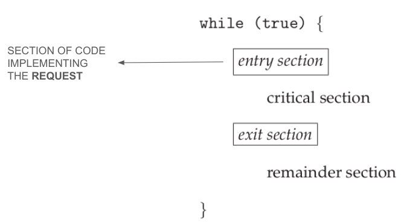

# The Critical-Section Problem

To guard against the race condition previously discussed, we need to ensure that **only one process** at a time can be manipulating the variable `count`. To make such a guarantee, we require that the processes be **synchronized** in some way.

Consider a system consisting of `n` processes `{P0, P1, ..., Pn-1}`, each having a segment of code called **critical section**, in which the process may be accessing and updating data that is shared with at least one other process.

:::note

The important feature is that **no** two processes are executing in their critical sections **at the same time**.

Each process must request permission to enter its critical section.

:::



## Requirements

A solution to the critical-section problem must satisfy the following three requirements:

1. **Mutual exclusion**: If process `Pi` is executing in its critical section, then no other processes can be executing in their critical sections.
2. **Progress**: If no process is executing in its critical section, but there are processes that actively wish to enter their critical sections, then there is a guarantee that eventually some process will be selected (i.e. no process can be blocked forever).
3. **Bounded waiting**: There exists a bound, or limit, on the number of times that other processes are allowed to enter their critical sections after a process has made a request to enter its critical section and before that request is granted.

## Peterson's solution

This is a classic software-based solution to the critical-section problem. Because of the way modern computer architectures perform basic machine-language isntructions, there are no guarantees that Peterson's solution will work correctly on such architectures.

However, it's important to be studied because it provides a good algorithmic description that addresses the requirements.

Peterson's solution is restricted to two processes, `P0` and `P1`, or for convenience, `Pi` and `Pj` with `j = 1 - i`.

The two processes share two data items:

```c
// whose turn it is to enter its critical section
// turn == i => Pi is allowed to execute in its critical section
int turn;

// indicates if a process is ready to enter
// flag[i] = true => Pi is ready to enter its critical section
boolean flag[2];
```

Let's describe the algorithm:

```c title="petersons_solution.c"
// Pi POV
while(true) {
    // I (Pi) am ready to enter my critical section
    flag[i] = true;

    // if Pj wishes to enter the cs, it can do so
    turn = j;

    // if both want to enter at the same time
    // turn will be set to both i and j at the same time
    // only one will last, the other will be overwritten
    // the eventual value determines which is allowed to enter first

    // if Pj wished to enter and is really his turn,
    // then I have nothing to do
    while (flag[j] && turn == j)
        ;

    /* critical section */

    // I don't want to enter my cs anymore
    flag[i] = false;

    /* remainder section */
}
```

## Hardware Instructions

Many modern computer systems provide special hardware instructions that allow us either to test and modify the content of a word or to swap the contents of two words **atomically** - that is, as one uninterruptible unit.

These special instructions will help us solve the critical-section problem in a relatively simple mnner.

### `test_and_set()`

The important characteristic of `test_and_set()` is that it is executed atomically.

```c
boolean test_and_set(boolean *target) {
    boolean rv = *target;
    *target = true;

    return rv;
}
```

We can implement **mutual exclusion** by declaring a boolean variable `lock = false`.

```c title="mutex.c"
// Pi POV
do {
    // if the lock is true, then someone else is in their cs
    // if it's false, then I can enter my cs and I set it true
    while (test_and_set(&lock))
        ;

    /* critical section */

    lock = false;

    /* remainder section */
} while (true);
```

### `compare_and_swap()`

The CAS instruction operates on two words atomically, but uses a different mechanism that is based on swapping the content of two words.

```c
int compare_and_swap(int *value, int expected, int new_value) {
    int temp = *value;

    if (*value == expected)
        *value = new_value;

    return temp;
}
```

```c title="mutex.c"
while (true) {
    // Pi POV

    // if the lock is false as I expect, set it true
    // if it's true, then someone else is in their cs
    while (compare_and_swap(&lock, 0, 1) != 0)
        ;

    /* critical section */

    // another process can enter its cs
    lock = 0;

    /* remainder section */
}
```

:::danger

This algorithm does not satisfy the bounded-waiting requirement!

Check the book for a solution that solves the issue.

:::
