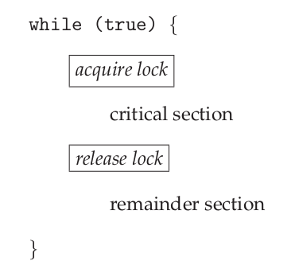

# Mutex Locks

Operating-system designers build higher-level software tools to solve the critical-section problem. The simplest of these tools is the **mutex lock**.

:::tip

**Mutex** is short for **mut**ual **ex**clusion.

:::

We use the mutex lock to protect critical sections and thus prevent race conditions. A process must **acquire** the lock before entering a critical section and **release** the lock when it exits the critical section.



## POSIX API

### `pthread_mutex_init()`

```
int pthread_mutex_init(pthread_mutex_t *mutex, const pthread_mutexattr_t *attr);
```

This creates an object of type `mutex` with `attr` attributes (for default, use **NULL**).

Put the variable in a zone where all threads can see it.

### `pthread_mutex_(un)lock()`

A mutex can be either **locked** or **unlocked**.

When the mutex is locked, a thread holds the control of the critical section until he gives up.

The critical section must be delimited by the functions:

```c
pthread_mutex_lock(&mtx);

/* critical section */

pthread_mutex_unlock(&mtx);
```

When we don't need the object anymore, we delete it using `pthread_mutex_destroy(pthread_mutex_t *mutex)`.
