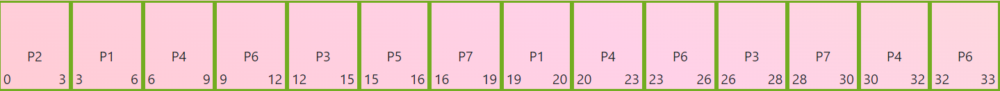
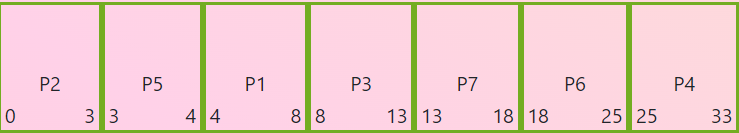
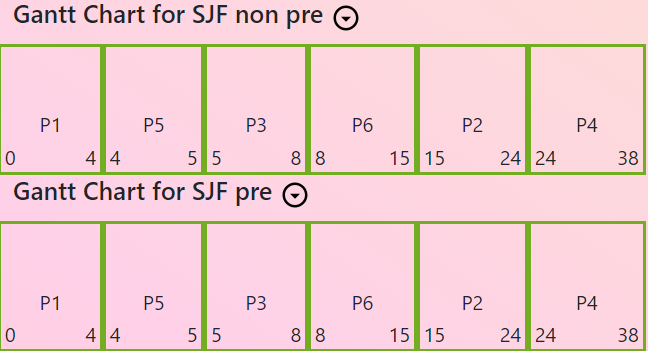

# Scheduling exercises

Test yourself with [this website](https://mukul2310.github.io/cpu-scheduler-visualiser/?source=post_page-----9dcc0ca76b54--------------------------------)

Let's practice the algorithms:

Given those processes:

| Process | Arrival time | Burst time (ms) |
| ------- | ------------ | --------------- |
| P1      | 1            | 4               |
| P2      | 0            | 3               |
| P3      | 3            | 5               |
| P4      | 2            | 8               |
| P5      | 3            | 1               |
| P6      | 2            | 7               |
| P7      | 4            | 5               |

**Exercise 1:** Apply Round Robin with q = 3 and write the Gantt chart

<i>💡Answer</i>

A solution is to add them by arrival time. P1, then P4, P6, and P3, P5.

Queue time 0 :

| Process | Time left |
| ------- | --------- |
| P2      | 3         |

Queue time 3:

| Process | Time left |
| ------- | --------- |
| P1      | 4         |
| P4      | 8         |
| P6      | 7         |
| P3      | 5         |
| P5      | 1         |

Queue time 6:

| Process | Time left |
| ------- | --------- |
| P4      | 8         |
| P6      | 7         |
| P3      | 5         |
| P5      | 1         |
| P7      | 5         |
| P1      | 1         |

(we've added P7 first, and then P1)  
...

**Exercise 2:** Calculate average wait time for the Round Robin with q = 3

<i>💡Answer</i>

P1 : 2 + 13 = 51 wait time  
P2: 0  
P3: 12 - 3 + 26 - 15 = 18  
P4: 4 + 11 + 7 = 32  
P5: 12  
P6: 7 + 11 + 6 = 24  
P7: 12 + 9 = 21

Avg wait time: 16

**Exercise 3:** write the gantt chart for SJF preemptive

<i>💡Answer</i>

On the exam, you can split in multiple boxes from 1 to 1 time unit.  
e.g. P2 0 1, P2 1 2, P2 1 3... (to illustrate that you verify for other processes) (but specify you don't do a context switch there)

**Exercise 4:** Average time for SJF preemptive.

Given this table with processes:

| Process | Arrival time | Burst time (ms) | Priority |
| ------- | ------------ | --------------- | -------- |
| P1      | 0            | 4               | 3        |
| P2      | 2            | 3               | 5        |
| P3      | 4            | 5               | 1        |
| P4      | 2            | 8               | 2        |
| P5      | 3            | 1               | 4        |
| P6      | 6            | 7               | 5        |

**Exercise 5:** Do the Gantt chart for SJF preemptive and non-preemptive

Hint: When you are running a process, if another comes with a bigger priority or same one but smaller burst time, context switch. After you end the process, take the smallest job first.

<i>💡Answer</i>

