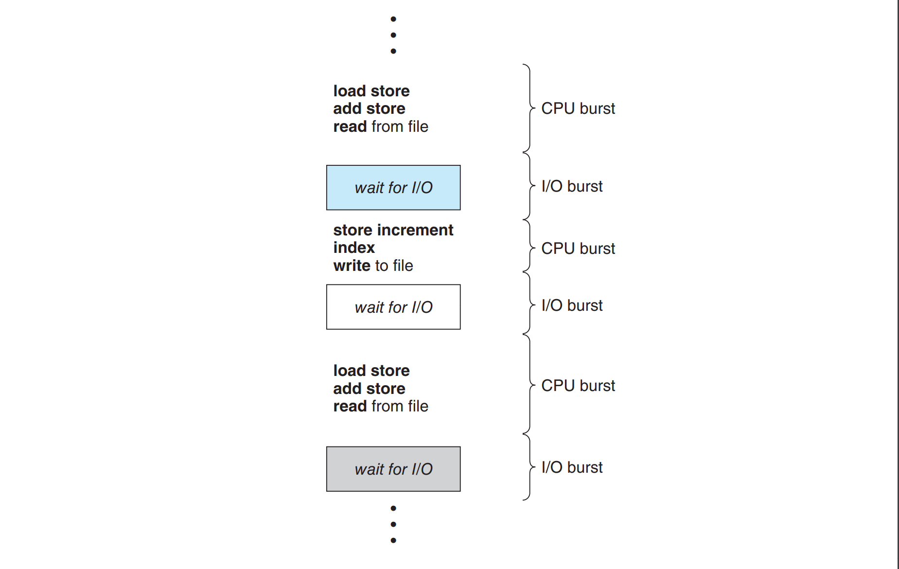
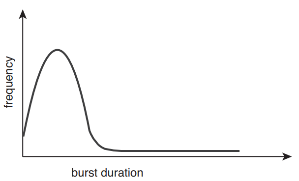
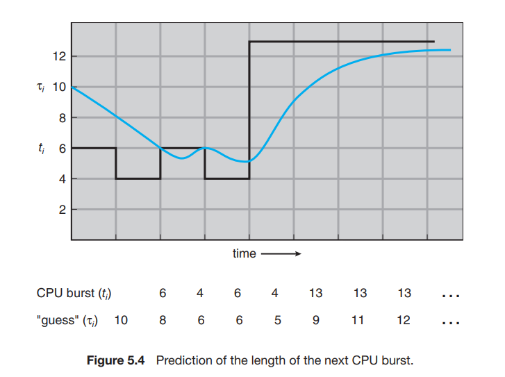
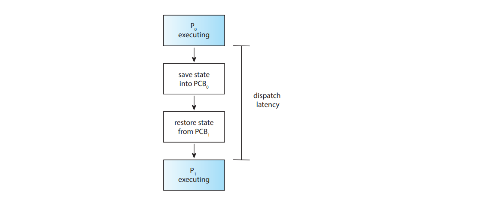
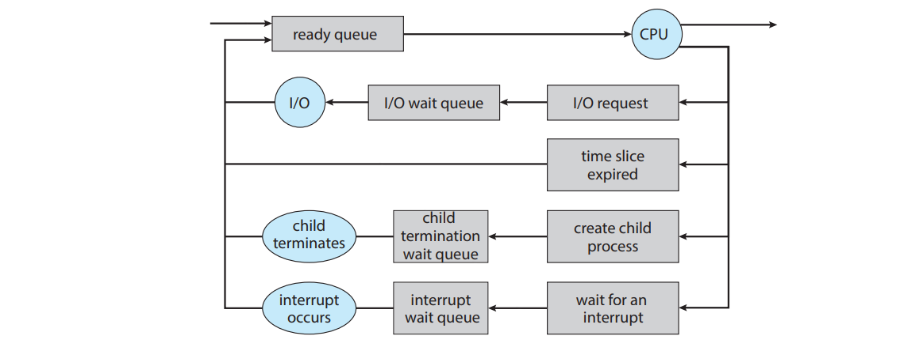

# CPU Scheduler introduction

Concept, what you need to know before, real-world usage, (6 minute reading)

> CPU scheduling is the basis of multiprogrammed operating systems. By switching the CPU among processes, the operating 
> system can make the computer
more productive (page 266 from this [book](https://os.ecci.ucr.ac.cr/slides/Abraham-Silberschatz-Operating-System-Concepts-10th-2018.pdf))

The idea is similar to average wait time [[Leetcode example]](https://leetcode.com/problems/average-waiting-time/description/) , namely we want 
to minimize the waiting time of the process to be executed on our available hardware. There are some criteria first we need
to consider before implementing a scheduler algorithm : 

## Scheduling Criteria

- **CPU utilization**. Keep the CPU as busy as possible. (`maximize`)
- **Throughput**. How many processes are completed per time unit. (`maximize`)
- **Turnaround time**. How long does it take to run a process. Calculated as the sum of the periods spent waiting in the
ready queue + executing on CPU + doing I/O. (`minimize`)
- **Waiting time**. Amount of time waiting in ready queue. (`minimize`)
- **Response**. Time it takes to start responding. (first time on CPU) (`minimize`)

## Prerequisite knowledge

An early intuition to resolve this problem is to think it as a FIFO (First In First Out), but in order to 
minimize the average time we need other algorithms and other ways to keep our data. 

First, we need to learn what a burst duration is, what is a preemptive, nonpreemptive scheduler and what a dispatcher is.

### Burst duration

Process execution consists of a cycle of CPU execution and I/O wait. Processes alternate between those 2 states.
An example is shown in this figure. 

The burst duration is essential to have for letting the scheduler algorithm know how much time will take for a specific
process to run. But how we know the duration before running it?

#### **Solution 1 - Look at the frequency curve**.    

The durations of CPU bursts have been measured extensively, thus we can 
predict the average burst time. 

#### **Solution 2 - predict the next cpu burst**  

We expect that the next CPU burst will be similar in length to the previous ones.
The next CPU burst is predicted as an `exponential average` of the measured length of previous CPU bursts. 

1. tn = actual length of n^th CPU burst.
2. Tn+1 = predicted value for next CPU burst
3. Tn = last guess
4. For alpha, `0 <= alpha <= 1` : `tn+1 = alpha * tn + (1 - alpha) * Tn`   
Generalized : `tn+1 = alpha * tn + ... + (1 - alpha)^j * alpha * Tn-j + ... + (1 - alpha)^ (n + 1) * T0`

We can choose alpha = 1/2 : recent history and past history are equally weighted.
Example : 

T0 = 10, t1 = 6. alpha = 1/2

T1 = 1/2 * 6 + (1 - 1/2) * 10 = 8   
T2 = 1/2 * 4 + (1 - 1/2) * 8 = 6   
T3 = 1/2 * 6 + (1 - 1/2) * 6 = 6    
...

### Preemptive and Nonpreemptive Scheduling

CPU scheduling decisions may take place when a process:
1. Switches from **running to waiting** state (e.g. wait() for the child in parent)
2. Switches from **running to ready** state (e.g. when interrupt occurs)
3. Switches from **waiting to ready** (e.g. at completion of I/O)
4. Terminates

1 & 4 => nonpreemptive
All of them => preemptive

> Under nonpreemptive scheduling, once the CPU has been allocated
to a process, the process keeps the CPU until it releases it either by terminating
or by switching to the waiting state.

> Whereas, preemptive scheduling, can change between processes multiple times until they finish.

`Question` : We talked about now about processes, but what about kernel mode? When we do a syscall the processes
interrupts and waits a response from kernel (read, open file, etc.). <u> This task is preemptive, or not? </u>  
(For the answer you can read the pages 202 and 262 from this [book](https://os.ecci.ucr.ac.cr/slides/Abraham-Silberschatz-Operating-System-Concepts-10th-2018.pdf))

Here is an useful table comparing preemptive and non-preemptive scheduling taken from [keeksforgeeks.org](https://www.geeksforgeeks.org/preemptive-and-non-preemptive-scheduling/)
| Parameter	| PREEMPTIVE SCHEDULING	| NON-PREEMPTIVE SCHEDULING
| :---------------- | :------: | ----: |
| Basic	| In this resources(CPU Cycle) are allocated to a process for a limited time. | Once resources(CPU Cycle) are allocated to a process, the process holds it till it completes its burst time or switches to waiting state
| Interrupt	| Process can be interrupted in between. | Process can not be interrupted until it terminates itself or its time is up
| Starvation |	If a process having high priority frequently arrives in the ready queue, a low priority process may starve | If a process with a long burst time is running CPU, then later coming process with less CPU burst time may starve
| Overhead	| It has overheads of scheduling the processes | It does not have overheads
| Flexibility |	flexible | Rigid
| Cost	| Cost associated | No cost associated
| CPU Utilization	| In preemptive scheduling, CPU utilization is high	| It is low in non preemptive scheduling
| Waiting Time | Preemptive scheduling waiting time is less	| Non-preemptive scheduling waiting time is high
| Response Time | Preemptive scheduling response time is less | Non-preemptive scheduling response time is high
| Decision making |	Decisions are made by the scheduler and are based on priority and time slice allocation	| Decisions are made by the process itself and the OS just follows the process’s instructions
| Process control |	The OS has greater control over the scheduling of processes	 | The OS has less control over the scheduling of processes
| Overhead	| Higher overhead due to frequent context switching	| Lower overhead since context switching is less frequent

### Dispatcher latency

> The dispatcher is the module that gives control of the CPU’s core to the process
selected by the CPU scheduler. 
> The time it takes for the dispatcher to stop one process and start
another running is known as the dispatch latency.

**IMPORTANT** : On every [context switch](https://os.ecci.ucr.ac.cr/slides/Abraham-Silberschatz-Operating-System-Concepts-10th-2018.pdf#page=152), the dispatcher is invoked. 

:::tip fun fact

You can see a process how many context switches had. [See here](https://unix.stackexchange.com/questions/39342/how-to-see-how-many-context-switches-a-process-makes).   
Also, with `vmstat 1 3` you can see the total context switches over a 3-second period. (in system column, below cs)
:::

### When a process is switched? 

Below, it will be shown when process stop running on the CPU: 

More could be written at [page 113](https://os.ecci.ucr.ac.cr/slides/Abraham-Silberschatz-Operating-System-Concepts-10th-2018.pdf#page=151)

## Examples of scheduler usage

- used in Embedded Systems and Real-Time Systems: 
  - In real-time systems, tasks must meet strict timing constraints (e.g., airbag deployment in cars). CPU scheduling principles are applied in these systems to ensure critical tasks are completed on time.
- High-Performance Computing (HPC) and Parallel Processing
  - In HPC, multiple tasks need to be scheduled across many cores or even multiple computers. CPU scheduling concepts help allocate tasks efficiently, balancing loads and minimizing idle times.
- Mobile Application Development
  - Mobile devices have limited resources, so efficient scheduling is critical to avoid battery drain and maintain performance. Mobile OS schedulers prioritize tasks based on CPU, GPU, and memory usage.
  - An example is [this article](https://www.researchgate.net/publication/261318367_Towards_Power-Efficient_Smartphones_by_Energy-Aware_Dynamic_Task_Scheduling) that talks about a scheduler for power-efficient smartphones

Extreme example `YouTube`:   
We can think about the YouTube scheduling recommendation algorithm as analogy for CPU scheduling. Now, let's take each criteria and convert it in YouTube mindset.

1. **CPU utilization -> User Engagement**  
In CPU scheduling, maximizing CPU utilization ensures that the processor is busy most of the time, making efficient use of resources. 
For YouTube’s recommendation algorithm, this translates to maximizing user engagement, 
which involves keeping users watching videos for extended periods.
2. **Throughput → Recommended Video Volume**   
Throughput in CPU scheduling refers to the number of processes completed in a given time frame. 
For YouTube’s algorithm, this becomes the number of videos recommended and watched within a session or a certain time period.
3. **Turnaround Time → Viewer Satisfaction Rate**   
In CPU scheduling, turnaround time is the total time taken to complete a process. 
For YouTube, we can relate this to the viewer satisfaction rate, which is how quickly users find content they enjoy. 
If users quickly find engaging videos, it indicates an effective algorithm.
4. **Wait Time → Recommendation Delay**
Wait time in CPU scheduling is the time a process spends waiting to be executed. 
On YouTube, this can be thought of as the delay before an appealing recommendation appears. 
Ideally, users should see engaging content immediately or soon after starting a session.
5. **Response Time → Immediate User Interaction**   
In CPU scheduling, response time is the time it takes for the system to start responding to a process. 
On YouTube, this relates to how quickly users interact with a video (clicking on it, watching, or taking some other action).

## Further reading 
- [More about context switches](https://eli.thegreenplace.net/2018/measuring-context-switching-and-memory-overheads-for-linux-threads/)
- [Avoid too much indirect switch costs, YouTube video by a Google Engineer](https://www.youtube.com/watch?v=KXuZi9aeGTw)
## References

- Operating Systems Concepts, 10th edition
- [Yale course on CPU Scheduler](https://codex.cs.yale.edu/avi/os-book/OS8/os8e/slide-dir/PDF-dir/ch5.pdf)
- [Cambridge course on CPU Scheduler](https://www.cl.cam.ac.uk/teaching/1617/OpSystems/pdf/05-Scheduling-Algorithms.pdf)
- [Standford course on CPU Scheduler](https://www.scs.stanford.edu/07au-cs140/notes/l5.pdf)
- [Geeksforgeeks - preemptive and nonpreemptive](https://www.geeksforgeeks.org/preemptive-and-non-preemptive-scheduling/)
- [Princeton course on CPU scheduler](https://www.cs.princeton.edu/courses/archive/fall18/cos318/lectures/8.CPUScheduling.pdf)
- [How do Modren Operating systems Handle Process Scheduling By Annie Telligent](https://biglysales.com/how-do-modern-operating-systems-handle-process-scheduling/)