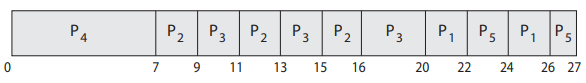

# CPU Scheduler Algorithms

FCSF, SJF, SRT, RR -> I don't have a stroke.

:::tip summary
Here we will see how those algorithms work :
- First come, First-Served Scheduling (FCFS)
- Shortest Job First Scheduling non-preemptive (SJF)
- Shortest Remaining Time First Scheduling (SRT)
- Round Robin (RR)
- Priority Scheduling
- Priority Scheduling + Round Robin
:::


### First come, First-Served Scheduling (FCFS)

Simplest possible scheduling algorithm, depending only on the order in which processes arrive and it is nonpreemptive.

Given the following demand: 

| Process | Burst time (ms) |
|---------|----------------|
| P1      | 24             |
| P2      | 3              |
| P3      | 3              |

If the order is P1, P2, P3, then we will have this Gantt chart : 


Throughput: 3 jobs / 30 ms = 0.1 jobs/ms   
Turnaround Time: P1: 24ms, P2: 27ms, P3: 30ms   
**Wait Time**: P1: 0ms, P2: 24ms, P3, 27ms   
Average waiting time: (0 + 24 + 27)/3 = 17ms   
**Average Turnaround time**: (24 + 27 + 30)/3 = 27   

What if they come in this order: P2, P3, P1?

<details>
<summary><i>Solution</i></summary>


Turnaround time: P1: 30ms, P2: 3ms, P3: 6ms    
Wait time: P1: 6ms, P2: 0ms, P3: 3ms   
Average turnaround time: (30 + 3 + 6)/3 = 13ms (much less than 27)   
Waiting time: (6 + 0 + 3)/3 = 3ms (much less than 17)   
</details>

*Lesson?* Minimize waiting time to minimize turnaround time!  

:::important question

**How can we test the runtime of a program?** For P3 we had a burst time of 3ms, but in real life it took
30ms to run (10 times more), and this number solely depends on the scheduler. 

Find the answer on [this page](https://sirbuig.github.io/operating-systems/category/weeks-1-2/test-speed-of-a-program.md)
:::


### Shortest Job First Scheduling non-preemptive (SJF)
- Attempts to minimize Turnaround time.
- Once a process is on CPU, it cannot be preempted until it completes its CPU burst and choose after the one with the lowest burst time.

| Process | Arrival time | Burst time (ms) |
|---------|--------------|-----------------|
| P1      | 0.0          | 7               |
| P2      | 2.0          | 4               |
| P3      | 4.0          | 1               |
| P4      | 5.0          | 4               |


### Shortest Remaining Time First Scheduling (SRTF)
- the preemptive form of SJF: if a new process arrives with CPU burst length less
  than remaining time of current executing process.

With the same table as on SJF, here is the Gantt chart:


**Time 2**: P1 has 5 burst time left, and P2 has 4 => We choose P2.    
**Time 4**: P1 = 5, P2 = 2, P3 = 1 => Choose P3    
**Time 5**: P1 = 5, P2 = 2, P3 = done, P4 = 4 => Now is SJF (P2 → P4 → P1)   

Possible issues: 
- Can lead to starvation
  - >Rumor has it that, when they shut down the IBM 7094 at MIT in 1973, they found a low-priority process that had been submitted in 1967 and had not yet been run.
- The algorithm is not efficient if n processes come at the same time with the same burst time.
- Context switches are not free: many very short burst length processes may trash the CPU
In practice, we can't predict the future, only estimate it based on the past.
Read this part of the page: [scheduler introduction - predict burst](scheduler-introduction.md#solution-2---predict-the-next-cpu-burst-)
### Round Robin (RR)

Round Robin is perhaps one of the most widely used scheduling algorithms in modern operating systems. 
It allocates CPU time to processes in a cyclic manner, with each process receiving a fixed time slice or 
quantum before being preempted and placed back in the ready queue.

* Fair: given n processes in the ready queue and time quantum q, each process gets 1/nth of the CPU
* Live: `no process waits` more than time `(n - 1) * q` units before receiving a CPU allocation
* Typically, get higher average turnaround time than SRTF, but better average response time  

:::warning risky to choose the correct size quantum, q
- q too large becomes FCFS/FIFO
- q too small becomes context switch overhead too high
- Real life typical values (said by stanford): 10-100msec
:::

:::tip solution
Make sure that 80% of CPU bursts should be shorter than q
:::

| Process | Burst time (ms) |
|---------|-----------------|
| P1      | 24              |
| P2      | 3               |
| P3      | 3               |

quantum = 4   

   

Another example: 5 processes with q = 20ms. Each process will run at least 20ms once 100ms. 

Other one: 5 processes: P1 = 6, P2 = 6, P3 = 6, q = 2.
We would have P1 → P2 → P3 → P1 → P2 → P3 → P1 → P2 → P3.   

**Limitations:**

- Overhead: The overhead associated with context switching can impact system performance, especially in scenarios with a large number of short-lived processes.   
- Inefficiency: Round Robin scheduling may not be suitable for scenarios where processes have vastly different execution times, leading to under utilization of CPU resources.

FCFS vs Round Robin: 
- 10 jobs and each takes 100 seconds
- FCFS (non-preemptive scheduling)
  - Turnaround time: P1 = 100s, P2 = 200s, ..., P10 = 1000s
- Round Robin (preemptive scheduling)
  - q = 1s
  - TT: P1 = 991s, P2 = 992s, ..., P10 = 1000s

:::note
For streaming video, RR is good, since everyone makes progress and gets a share "all the time".
:::
### Priority Scheduling   
Priority scheduling assigns priorities to processes based on factors such as time limits, memory requirements, or the number of open files. It could be also funds being paid for computer use, the department sponsoring th work, and other, often political, factors.   

Higher-priority processes are allocated CPU time before lower-priority ones, allowing critical tasks to preempt less critical ones when necessary.
   
Analogy: SJF is a priority scheduling algorithm where priority is the predicted next CPU burst time.

- Starvation — low priority processes may never execute 

:::tip solution
  Aging — increase a process's priority as it waits
::: 

| Process | Burst time | priority |
|---------|------------|----------|
| P1      | 10         | 3        |
| P2      | 1          | 1        |
| P3      | 2          | 4        |
| P4      | 1          | 5        |
| P5      | 5          | 2        |


It is observed that the smaller the number of the priority, the higher importance it has. 
### Priority Scheduling + Round Robin
Use priority scheduling with round-robin for processes with equal priority.

| Process | Burst time | priority |
|---------|------------|----------|
| P1      | 4          | 3        |
| P2      | 5          | 2        |
| P3      | 8          | 2        |
| P4      | 7          | 1        |
| P5      | 3          | 3        |



### (optional) Multilevel Queue Scheduling
Multiple queues that represent a priority. Each queue can have a different scheduler algorithm based on their needs.
More information at [page 214](https://os.ecci.ucr.ac.cr/slides/Abraham-Silberschatz-Operating-System-Concepts-10th-2018.pdf#page=281)

### (optional) Multilevel Feedback Queue Scheduling
Example:
- Q0 - RR with time quantum 8 milliseconds
- Q1 - RR time quantum 16 milliseconds
- Q2 - FCFS

Idea : A job enters in Q0 and it is allocated 8 milliseconds for it. 
```pseduocode
If the process doesn't end:
  Go to Q1 and runs for 16 miliseconds
  If it doesn't end:
    go to Q2
  else:
    end
else:
  end the job
```

In general, a multilevel feedback queue scheduler is defined by the following parameters:   
• The number of queues  
• The scheduling algorithm for each queue   
• The method used to determine when to upgrade a process to a higherpriority queue  
• The method used to determine when to demote a process to a lowerpriority queue   
• The method used to determine which queue a process will enter when that process needs service


## Further reading 
- [thread scheduling from the book](https://os.ecci.ucr.ac.cr/slides/Abraham-Silberschatz-Operating-System-Concepts-10th-2018.pdf#page=284)
- [thread scheduling from stanford](https://www.scs.stanford.edu/07au-cs140/notes/l5.pdf#page=31)
- [multi processor Scheduling](https://os.ecci.ucr.ac.cr/slides/Abraham-Silberschatz-Operating-System-Concepts-10th-2018.pdf#page=287)
- [lottery scheduling](https://www.cs.princeton.edu/courses/archive/fall18/cos318/lectures/8.CPUScheduling.pdf#page=5) + [this one](https://www.geeksforgeeks.org/lottery-process-scheduling-in-operating-system/)
- [linux kernel schedulers](https://documentation.ubuntu.com/real-time/en/latest/explanation/schedulers/)
- [How quantum is chosen on windows](https://empyreal96.github.io/nt-info-depot/Windows-Internals-PDFs/Windows%20System%20Internals%207e%20Part%201.pdf#page=244)
### References
- Operating Systems Concepts, 10th edition
- [Fatal software errors](https://jornbettin.com/2011/04/23/fatal-software-errors/)
- [Yale course on CPU Scheduler](https://codex.cs.yale.edu/avi/os-book/OS8/os8e/slide-dir/PDF-dir/ch5.pdf)
- [Cambridge course on CPU Scheduler](https://www.cl.cam.ac.uk/teaching/1617/OpSystems/pdf/05-Scheduling-Algorithms.pdf)
- [Standford course on CPU Scheduler](https://www.scs.stanford.edu/07au-cs140/notes/l5.pdf)
- [Geeksforgeeks - preemptive and nonpreemptive](https://www.geeksforgeeks.org/preemptive-and-non-preemptive-scheduling/)
- [Princeton course on CPU scheduler](https://www.cs.princeton.edu/courses/archive/fall18/cos318/lectures/8.CPUScheduling.pdf)
- [How do Modren Operating systems Handle Process Scheduling By Annie Telligent](https://biglysales.com/how-do-modern-operating-systems-handle-process-scheduling/)