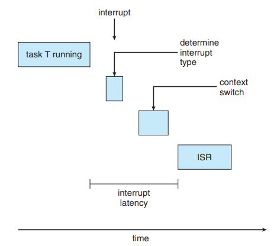

# Real-time scheduling

> The Real-Time Scheduler is designed for real-time applications that require guaranteed and deterministic CPU time. 
> It uses a priority-based scheduling algorithm to ensure that high-priority processes get the CPU time they need. 
> The Real-Time Scheduler is optimized for real-time applications, such as industrial control systems and embedded devices,
> where low latency and predictable performance are critical. (Written [on this site](https://documentation.ubuntu.com/real-time/en/latest/explanation/schedulers/))

There are two systems:   
- **Soft real-time systems** : it will only guarantee that the process will be given preference over non-critical processes
- **Har real-time systems** : there is a deadline for the process, service after the
  deadline has expired is the same as no service at all   

**Event latency** : amount of time elapsed from when an event occurs to when it is serviced. Similar to Turnaround time from cpu scheduling.

E.g. The event latency is important for automobiles, meaning the antilock brake system needs latency of 3 to 5 milliseconds. 
If the response time takes longer, the automobile might get out of control.

**Interrupt latency** : period of time from the arrival of an interrupt
at the CPU to the start of the routine that services the interrupt.

To be more precise: save the state of the current process (context switch), determine the type of interrupt that occurred and at the end run
the interrupt service routine.(ISR)

**Dispatch latency** : amount of time required for the scheduling dispatcher to stop one
process and start another.

