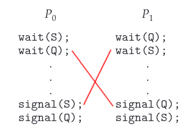

# Deadlock

The implementation of a semaphore with a waiting queue may result in a situation where two or more processes are waiting **indefinitely** for an event that can be caused **only by one of the waiting processes.**

When such a state is reached, these processes are said to be **deadlocked**.

## Illustration

Consider two processes, `P0` and `P1`, accessing the semaphores `S` and `Q` (set to the value 1):

If `P0` executes `wait(S)` and `P1` executes `wait(Q)`, when `P0` executes `wait(Q)`, it must wait until `P1` executes `signal(Q)`. The same for when `P1` tries to execute `wait(S)` and needs `P0` to execute `signal(S)`.

:::tip

Remember that a semaphore cannot have its value `< 0`, that's why in our case, after `wait()` we must `signal()`.

Since `signal()` cannot be executed, `P0` and `P1` are deadlocked.

:::

We say that a set of processes is in a deadlocked state when **every process in the set is waiting for an event that can be caused only by another process in the set**.

