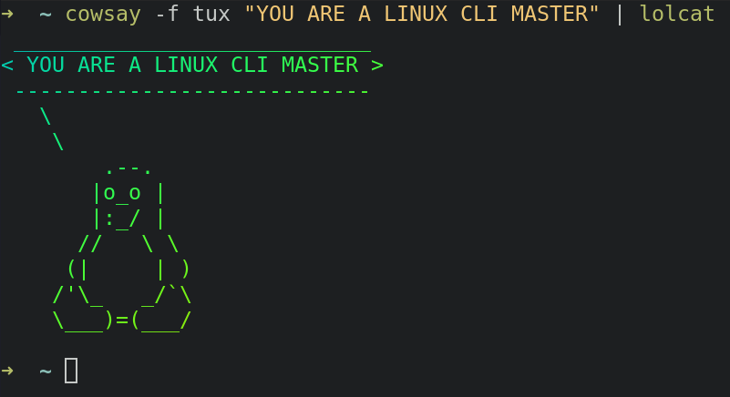

# Kickstart Your Linux Journey

Until now you've probably mainly experienced the GUI world - `point, click, drag, and drop`. You've clicked buttons and moved windows around like a pro!
But things are going to change now. You're going to learn how to use the terminal and here's why it's great.

## CLI Spells

### Goodbye Mouse, Hello Keyboard

The reasons you would want to shift your focus to your keyboard shortcuts as well are:

- You'll look cool, like in [Mr. Robot](https://youtu.be/PGjLhOhMLXc?si=f2wppas_IsXQghgq)
- You can automate a whole bunch of processes
- The more you practice, the faster and more natural it gets
- You won't always have access to GUI, and you need to know how to talk with the system without it

The first and most important shortcut you're going to learn is `Ctrl + Alt + t`. As you can see, a misterious dark box is now on your screen.

This is called a **terminal** and is there to help us communicate with the operating system via text. The communication is based on **commands**, hence the terminal's actual name: **Command-Line Interface (CLI)**.

Some other quick shortcuts you can try on the spot:

- `Ctrl + d`: close the current window
- `Ctrl + Shift + c`: copy text from the terminal
- `Ctrl + Shift + v`: paste text to the terminal

### The Prompt

Every terminal has a **prompt** that lets us know about the directory we're in, who the user and hostname are and if it's ready to execute a command.

This is generally the format of the prompt with very little variation:

```console
user@hostname:~$ cd Documents/
user@hostname:~/Documents$
```

More generally:

```console
[USERNAME]@[HOSTNAME]:[PATH][SYMBOL]
```

> User? Hostname? Symbol? What are you talking about?

- `[USERNAME]` is the username of the current user. That's usually you, except when you run `sudo su` to access the `root` user.
- `[HOSTNAME]` is your computer's name, which you set during system installation.
- `[PATH]` is your current working directory. Every time you open a new terminal, the default directory is your home directory. `~` is shorthand for `/home/YOURUSERNAME`.
- `[SYMBOL]` is `$` for a normal user and `#` for `root`. This symbol can be customized.

You can verify all of the above by typing these commands in the terminal:

- `whoami` to check the username
- `hostname` to check the hostname
- `pwd` to print the working directory

```console
sirbu@pop-os:~$ whoami
sirbu
sirbu@pop-os:~$ sudo su
[sudo] password for sirbu:
root@pop-os:/home/sirbu# whoami
root
root@pop-os:/home/sirbu# exit
exit
sirbu@pop-os:~$ hostname
pop-os
sirbu@pop-os:~$ pwd
/home/sirbu
sirbu@pop-os:~$
```

### Where am I?

You may feel confused about directories and navigating through files in your system, but don't worry—everything is under control.

We need to know where we are in the **file hierarchy**, also called the **file system**. If Windows uses `\` as a path separator, Linux uses `/`, and `/` also represents the root of the file system.


As you can see, everything has its place in the system and is navigable, like a map.

Moving between folders is called **changing the directory**.

Open a new terminal and try to see where you are. As mentioned earlier, the default path is `~` or `/home/username`. If you want to move somewhere else, use this command:

```console
$ cd /path/to/new/location
```

For example, to move to `Documents`:

```console
sirbu@pop-os:~$ cd Documents/
sirbu@pop-os:~/Documents$
```

### Preview the contents of a folder

You can list the contents of the current directory with the `ls` command (short for list):

```console
sirbu@pop-os:~/Documents/FMI-UNIBUC$ ls
an_2  an_3  README.md
sirbu@pop-os:~/Documents/FMI-UNIBUC$
```

Every command can take many parameters, including `ls`. If you give a path as a parameter, you can "preview" the files that are there without leaving your current directory!

```console
sirbu@pop-os:/$ ls #contents of "/" aka root directory
bin   dev  home  lib32  libx32      media  opt   recovery  run   srv  tmp  var
boot  etc  lib   lib64  lost+found  mnt    proc  root      sbin  sys  usr
sirbu@pop-os:/$ ls media/ #contents of media/
root  sirbu
```

:::tip TAB is your friend

Press `TAB` as much as you can.

If you give enough context, your command will be autocompleted.

For example, while being in `~`, try typing `cd Doc`, press `TAB`, and your command will become `cd Documents/`

If the context is not clear enough, you will see all the options in the terminal:

```console
sirbu@pop-os:~$ cd D
Desktop/   Documents/ Downloads/
```

:::

To return to the previous folder or list its contents, use `..`:

```console
sirbu@pop-os:~$ ls ../ # contents of the parent directory
sirbu
sirbu@pop-os:~$ ls ../../ # contents of the "root" folder, two levels up
bin   dev  home  lib32  libx32      media  opt   recovery  run   srv  tmp  var
boot  etc  lib   lib64  lost+found  mnt    proc  root      sbin  sys  usr
sirbu@pop-os:~$ cd ../../ # now we'll be in the "root" folder!
sirbu@pop-os:/$ pwd
/
sirbu@pop-os:/$
```

:::note

The more you chain `../..`, the higher you traverse the file structure.

:::

### Use your creator powers

You can create a directory with `mkdir`:

```console
sirbu@pop-os:~/demo$ mkdir dummy-folder
sirbu@pop-os:~/demo$ ls
dummy-folder
sirbu@pop-os:~/demo$ cd dummy-folder/
sirbu@pop-os:~/demo/dummy-folder$
```

Let's **create** files inside our newly made folder with `touch`:

```console
sirbu@pop-os:~/demo/dummy-folder$ touch demo-file1
sirbu@pop-os:~/demo/dummy-folder$ touch demo-file2
sirbu@pop-os:~/demo/dummy-folder$ ls
demo-file1  demo-file2
```

Our files are kinda empty, so let's add some text:

```console
sirbu@pop-os:~/demo/dummy-folder$ cat demo-file1 # output the contents of the file
sirbu@pop-os:~/demo/dummy-folder$ nano demo-file1 # a simple command-line text editor
sirbu@pop-os:~/demo/dummy-folder$ cat demo-file1
Write anything you want, it doesn't really matter.
sirbu@pop-os:~/demo/dummy-folder$
```

**Move** stuff around with `mv`:

```console
sirbu@pop-os:~/demo/dummy-folder$ ls
demo-file1  demo-file2  folder2
sirbu@pop-os:~/demo/dummy-folder$ mv demo-file1 folder2/
sirbu@pop-os:~/demo/dummy-folder$ ls
demo-file2  folder2
sirbu@pop-os:~/demo/dummy-folder$ ls folder2/
demo-file1
sirbu@pop-os:~/demo/dummy-folder$
```

**Copy** files with `cp`:

```console
sirbu@pop-os:~/demo/dummy-folder$ cp demo-file2 folder2/
sirbu@pop-os:~/demo/dummy-folder$ ls folder2/
demo-file1  demo-file2
sirbu@pop-os:~/demo/dummy-folder$ ls
demo-file2  folder2
```

**Remove** with `rm`:

```console
sirbu@pop-os:~/demo/dummy-folder$ rm demo-file2
sirbu@pop-os:~/demo/dummy-folder$ ls
folder2
sirbu@pop-os:~/demo/dummy-folder$ rmdir folder2/
rm: cannot remove 'folder2/': Is a directory
```

If `folder2` were empty, the command would have worked fine. Since it's not, we must pass `-r` (for `--recursive`) for it to work.

```console
$ rm -r folder2/ # in this case, rm works as well
```

### This `man` has all the info you need

Extensive documentation is available for almost every Linux command and can be accessed with `man command`. Knowing how to read the `manual` is essential.

Let's try reading the page for `cat`.

```console
$ man cat
```

Use:

- `↑` and `↓` to scroll
- `Space` to scroll one page down
- `/<string>` for quick search
- `q` to quit.

## `Root` is the most important

Linux systems have multiple levels of privilege, and your actions are limited by your privilege level.

Similar to the `Administrator` role in Windows, `root` is the boss and is required whenever you need to make decisions that could affect the system.

:::danger

The `root` role must be used with caution! You can damage your system irreversibly if you don't know what you're doing.

:::

## Shell operators

### Redirection operator `>`

This is used to redirect the output of a command to a file. If the file exists, it will be overwritten.

```console
sirbu@pop-os:~/demo$ cat demo-file
This is the original text!
sirbu@pop-os:~/demo$ echo "Some text" # write text to the terminal window
Some text
sirbu@pop-os:~/demo$ echo "Some text" > demo-file
sirbu@pop-os:~/demo$ cat demo-file
Some text
sirbu@pop-os:~/demo$
```

### Pipe `|`

This operator takes the output of one command and passes it as input to another command. It's used for chaining commands together.

```console
sirbu@pop-os:~/demo$ ls | grep "folder"
dummy-folder
sirbu@pop-os:~/demo$ ls
demo-file  dummy-folder
sirbu@pop-os:~/demo$
```

### Logical AND `&&`

This operator is used to execute the second command only if the first command succeeds (returns exit code 0).

```console
sirbu@pop-os:~/demo$ mkdir test-and && cd test-and
sirbu@pop-os:~/demo/test-and$
```

## More Terminal Tricks

- use `up arrow` and `down arrow` to navigate between your commands
- use `sudo !!` to execute the last command with `admin` rights



## Further Reading

- [Absolute and relative paths](https://www.redhat.com/en/blog/linux-path-absolute-relative)
- [Root Folders explained](https://averagelinuxuser.com/linux-root-folders-explained/)
- [Linux operators](https://www.networkworld.com/article/2516127/linux-operators-using-and-many-more.html)
- [Piping and Redirection](https://www.freecodecamp.org/news/linux-terminal-piping-and-redirection-guide/)
- [2-Minute Linux: `&&` operator](https://youtu.be/vzFYVogxHZI?si=aNRNHL6Dftwy_VEY)
- [`cat` command with operators in action](https://hostman.com/tutorials/linux-cat-command/)
- [Top Linux commands you must know](https://www.digitalocean.com/community/tutorials/linux-commands)
- [Command Prompt](https://www.redhat.com/en/blog/command-prompt-tell-me)
- [SSS Scratch Linux - Exploration tools](https://security-summer-school.github.io/essentials-security/Scratch%20Linux/System%20Exploration/Reading/exploration-tools)
- [cowsay](https://github.com/piuccio/cowsay)
- [lolcat](https://github.com/busyloop/lolcat)

## References

- [OS-Lab1](https://cs.unibuc.ro/~pirofti/so/so-lab-1.pdf)
- [SSS Scratch Linux - Working with Linux](https://security-summer-school.github.io/essentials-security/Scratch%20Linux/Welcome%20to%20Linux/Reading/working-with-linux)
